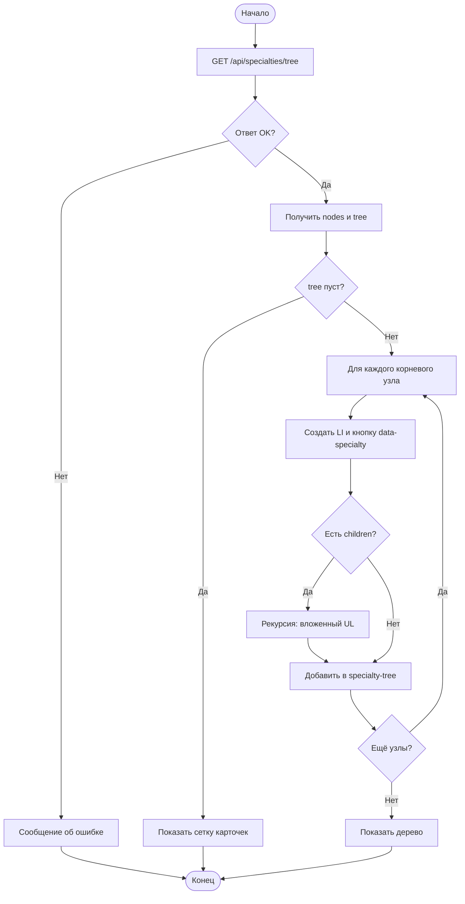
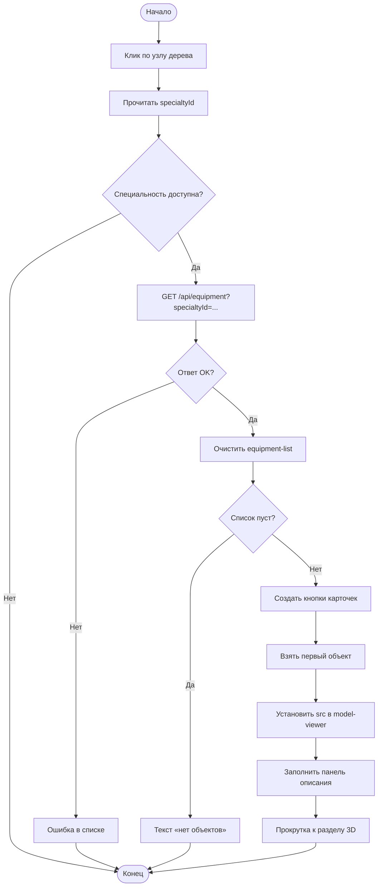
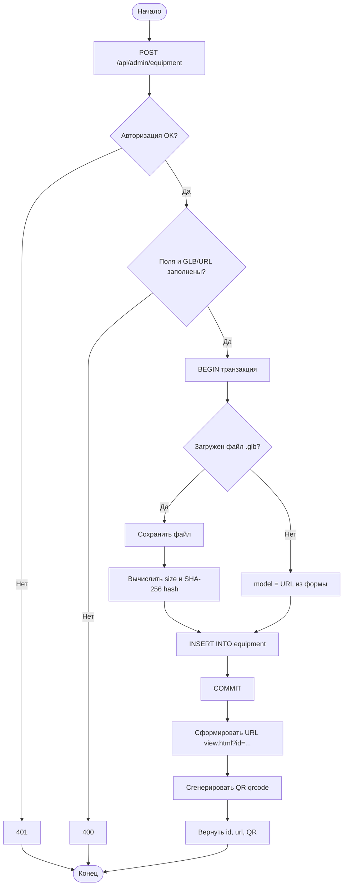
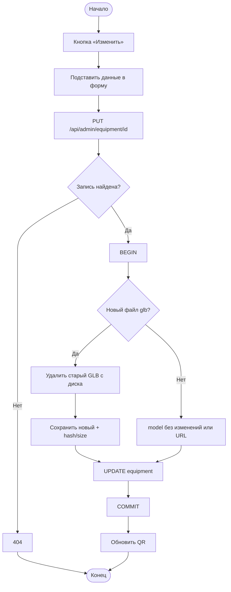
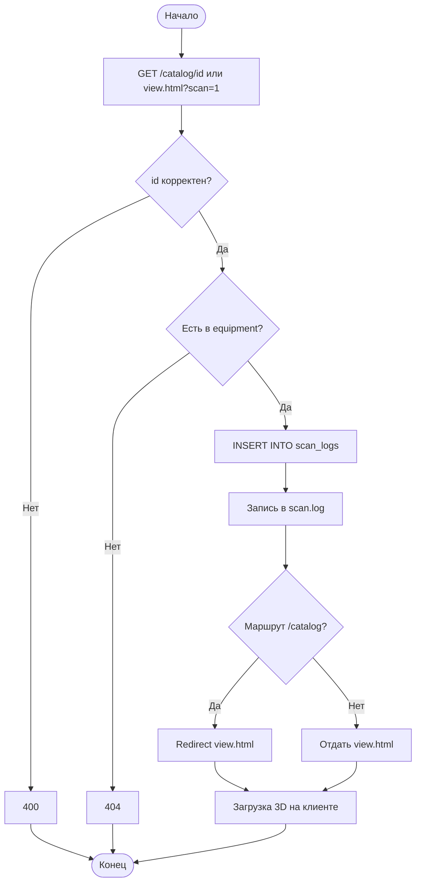
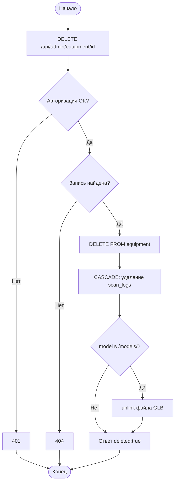

# Блок-схемы (Mermaid) — Приложения А–Е

Откройте https://mermaid.live , вставьте код одной схемы, экспортируйте PNG/SVG в отчёт.

---

## Приложение А — Дерево специальностей

---

## Приложение Б — Каталог экспонатов

---

## Приложение В — Добавление экспоната и QR

---

## Приложение Г — Редактирование экспоната

---

## Приложение Д — Логирование сканирования QR

---

## Приложение Е — Каскадное удаление

