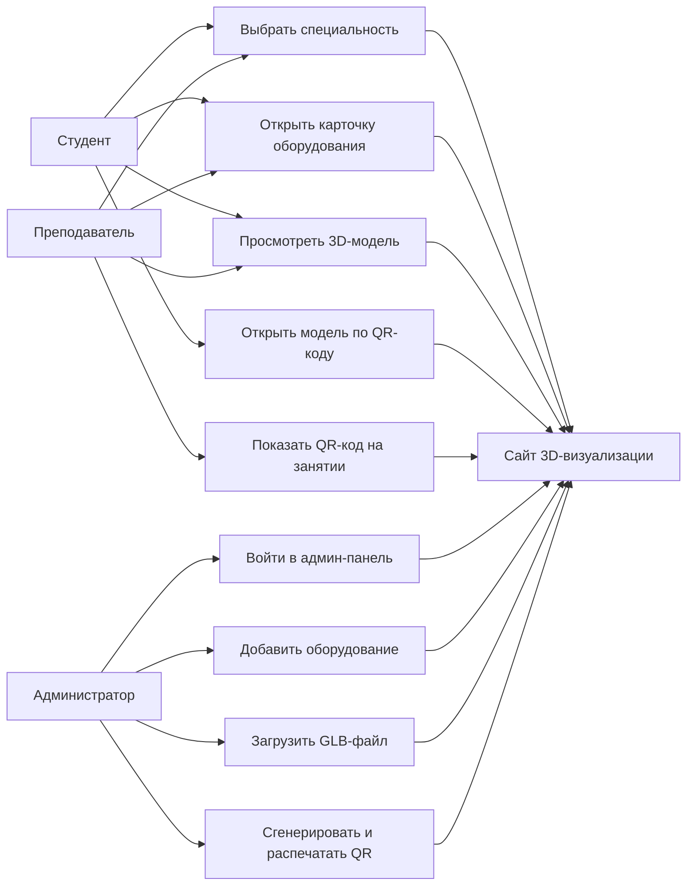
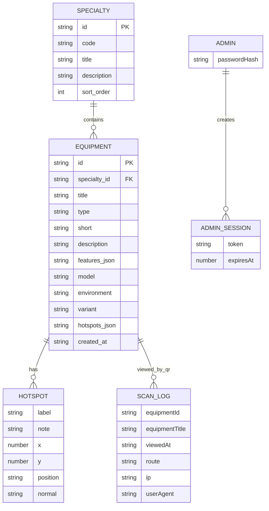
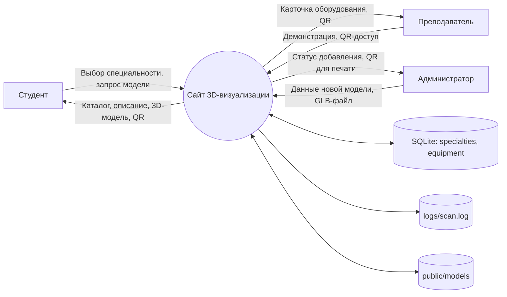
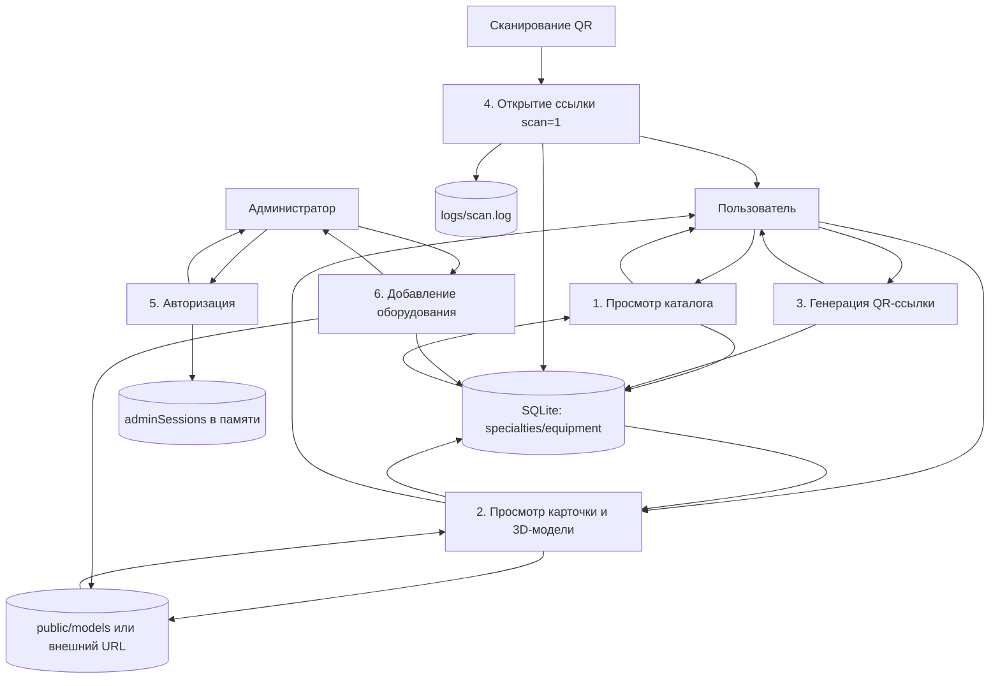
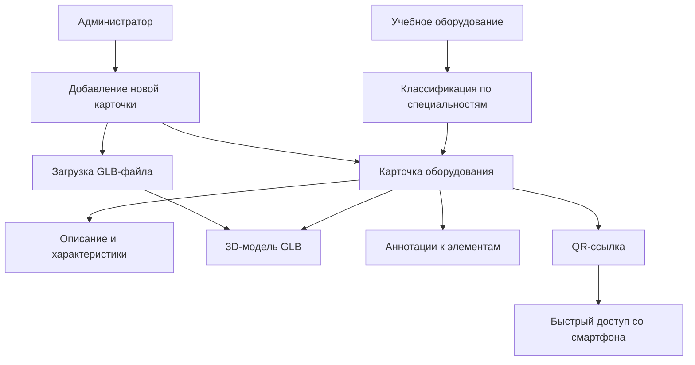
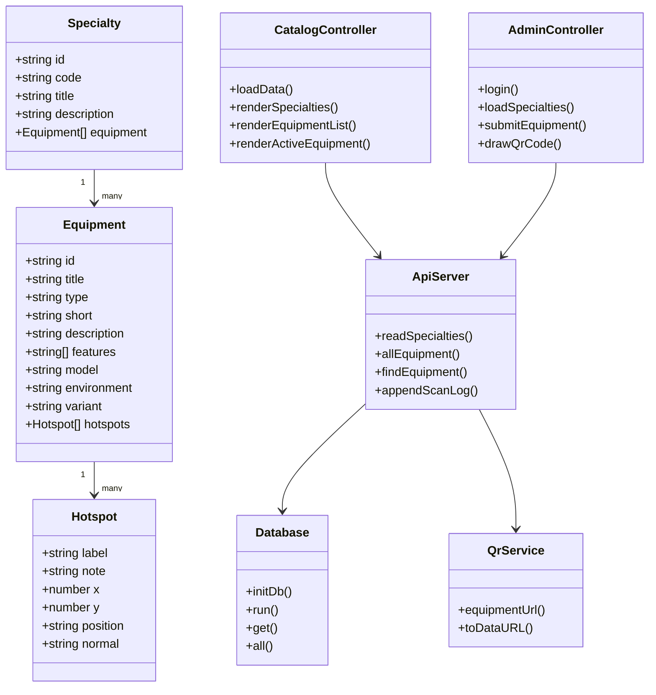
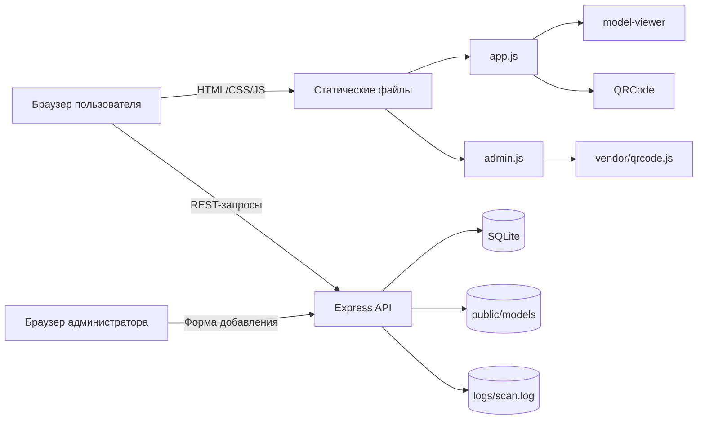
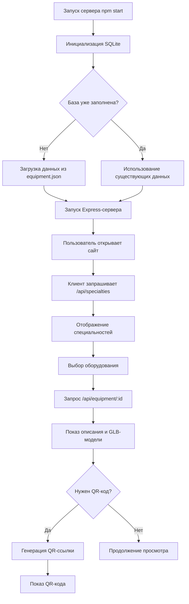
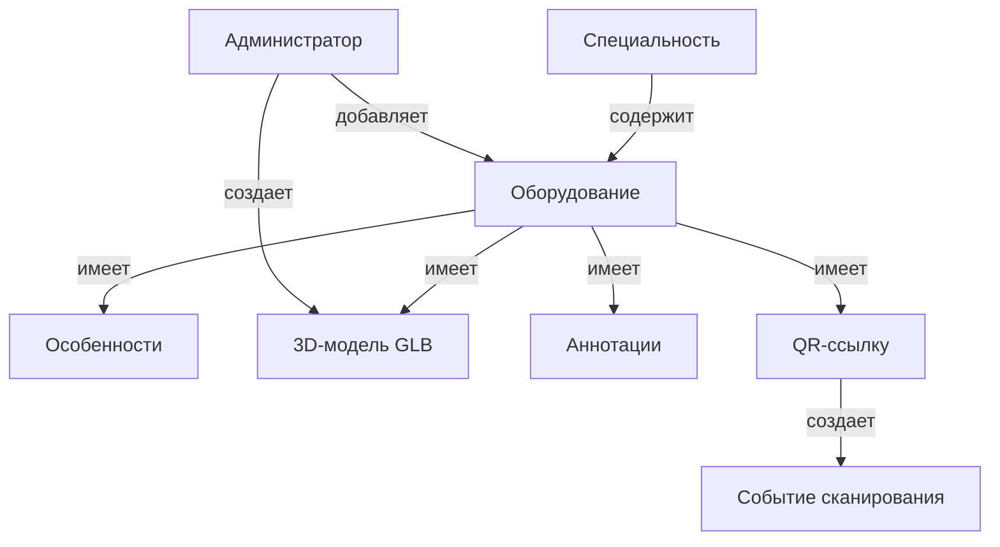
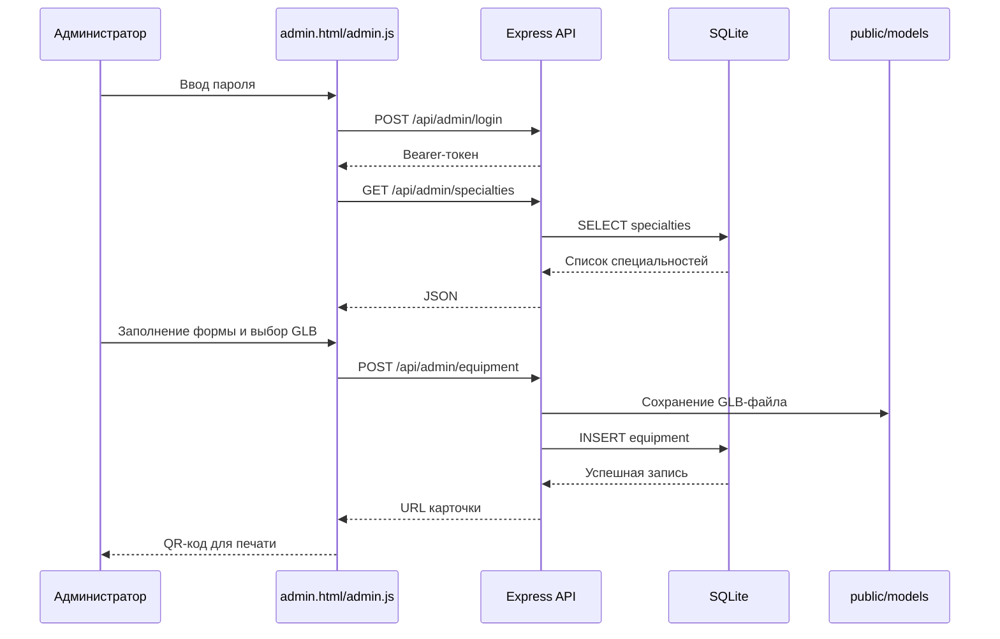

# Отчет по производственной практике

**Обучающийся:** Казаков Владимир Александрович  
**Место прохождения практики:** КГБПОУ "Алтайский Промышленно-Экономический Колледж"  
**Сроки прохождения практики:** 20.04.2026 - 16.05.2026  
**Тема работы:** разработка программного изделия для интерактивной 3D-визуализации учебного оборудования  

> Примечание для оформления: Mermaid-блоки можно вставить в редактор, поддерживающий Mermaid, либо отрисовать через mermaid.live и вставить как рисунки в Word. Строки вида "Рисунок ..." оставлены как места для скриншотов или готовых диаграмм.

---

## Содержание

1. Введение  
2. Ознакомление с предприятием  
3. Назначение и характеристика программного изделия  
4. Требования к программному изделию  
5. Предпроектное обследование и функциональные требования  
6. Информационно-логическая схема данных  
7. Функциональная модель предметной области, DFD и диаграмма классов  
8. Проектные решения и выбор инструментальных средств  
9. Входная и выходная информация, алгоритм решения задачи и контрольный пример  
10. Инфологическая модель задачи  
11. Неформальное описание алгоритма  
12. Анализ информационных ресурсов, конфиденциальности и угроз безопасности  
13. Резервирование и восстановление данных  
14. Декомпозиция задачи на модули и отладка  
15. Оценка затрат  
16. Пользовательский интерфейс и навигация  
17. Система тестирования программного изделия  
18. Справочная система и документация программиста  
19. Заключение  

---

## 1. Введение

В период прохождения производственной практики с 20.04.2026 по 16.05.2026 была выполнена работа по анализу, проектированию, реализации и документированию программного изделия для учебного заведения. Разрабатываемое программное изделие представляет собой сайт для интерактивной 3D-визуализации учебного оборудования.

Цель работы - создать удобный веб-инструмент, с помощью которого студенты и преподаватели могут выбирать специальность, открывать карточку оборудования, изучать описание объекта, просматривать 3D-модель и получать QR-код для быстрого перехода к выбранной модели.

В ходе практики были выполнены следующие основные задачи:

- ознакомление с организацией и предметной областью;
- формулировка требований к программному изделию;
- построение логической и функциональной моделей;
- разработка структуры данных и модулей приложения;
- реализация серверной части, клиентского интерфейса и административной панели;
- анализ информационной безопасности;
- описание резервного копирования и восстановления данных;
- подготовка тестов, справочных материалов и документации.

---

## 2. Ознакомление с предприятием

Производственная практика проходила на базе КГБПОУ "Алтайский Промышленно-Экономический Колледж". Учебное заведение осуществляет подготовку обучающихся по профессиональным направлениям, требующим применения учебных стендов, макетов, оборудования, цифровых материалов и методических ресурсов.

В рамках ознакомления с предприятием были выделены особенности предметной области:

- наличие учебного оборудования по разным специальностям;
- необходимость наглядного представления объектов для студентов;
- потребность в быстром доступе к карточкам оборудования во время занятий;
- использование локального сервера учебного заведения;
- необходимость администрирования каталога без изменения исходного кода;
- важность простого интерфейса для пользователей без специальной технической подготовки.

Разрабатываемая система ориентирована на использование в образовательной среде. Она может применяться в аудиториях, лабораториях и на учебных стендах, где рядом с физическим объектом размещается QR-код. После сканирования QR-кода пользователь открывает страницу с описанием и 3D-моделью оборудования.

**Рисунок 1 - Главная страница сайта с каталогом специальностей.**

---

## 3. Назначение и характеристика программного изделия

Программное изделие является веб-приложением "3D визуализация учебного оборудования". Оно состоит из публичной части сайта, административной панели, серверного API и хранилища данных SQLite.

Основное назначение системы:

- хранение каталога специальностей и учебного оборудования;
- отображение карточек оборудования;
- интерактивный просмотр 3D-моделей в формате GLB;
- отображение аннотаций к частям модели;
- генерация QR-кодов для быстрого доступа к карточкам;
- добавление новых моделей через административную панель;
- хранение данных в SQLite и начальная загрузка данных из JSON.

Фактическая структура проекта:

| Файл или каталог | Назначение |
| --- | --- |
| `server.js` | Express-сервер, API, SQLite, загрузка GLB-файлов, QR-коды, безопасность |
| `index.html` | Главная страница публичного каталога |
| `app.js` | Логика клиентской части: каталог, выбор модели, QR-модальное окно |
| `admin.html` | Страница административной панели |
| `admin.js` | Авторизация администратора, форма добавления оборудования, печать QR |
| `styles.css` | Стили интерфейса сайта и админ-панели |
| `data/equipment.json` | Исходные данные для первичного заполнения каталога |
| `data/equipment-data.js` | Резервные данные для работы клиентской части при недоступности API |
| `data/equipment.sqlite` | SQLite-база данных, создается автоматически при запуске |
| `public/models/` | Каталог для загружаемых GLB-моделей |
| `vendor/qrcode.js` | Локальная библиотека генерации QR-кодов для админ-панели |
| `scripts/verify-data-fallback.js` | Проверка синхронизации JSON-данных и браузерного fallback-файла |
| `package.json` | Зависимости и команды запуска/проверки |

Используемые специальности и разделы каталога:

- ОИБ - обеспечение информационной безопасности;
- ПД - правоохранительная деятельность;
- ЗЕМ - земельно-имущественные отношения.

**Рисунок 2 - Карточка оборудования и область просмотра 3D-модели.**

---

## 4. Требования к программному изделию

### 4.1. Цель формулирования требований

Формулирование требований необходимо для определения того, какие функции должна выполнять система, какие данные она должна хранить и какие ограничения необходимо учитывать при разработке.

### 4.2. Пользователи системы

В системе выделены следующие роли:

| Роль | Описание |
| --- | --- |
| Студент | Просматривает каталог, выбирает оборудование, изучает 3D-модель и описание |
| Преподаватель | Использует сайт на занятиях, демонстрирует модели, размещает QR-коды |
| Администратор | Добавляет новые модели, указывает описание и печатает QR-код |

### 4.3. Функциональные требования

Система должна обеспечивать:

1. Отображение списка специальностей.
2. Отображение списка оборудования выбранной специальности.
3. Открытие карточки оборудования.
4. Просмотр 3D-модели в браузере.
5. Вращение и масштабирование модели.
6. Отображение аннотаций к частям модели.
7. Генерацию QR-кода для выбранного оборудования.
8. Переход к карточке оборудования по ссылке из QR-кода.
9. Авторизацию администратора.
10. Добавление нового оборудования через форму.
11. Загрузку файла модели `.glb` или указание внешнего URL.
12. Сохранение информации в SQLite.
13. Начальное заполнение базы из JSON-файла.
14. Проверку согласованности резервного файла данных.

### 4.4. Нефункциональные требования

К системе предъявляются следующие нефункциональные требования:

- работа через веб-браузер без установки клиентского приложения;
- запуск на локальном сервере учебного заведения;
- простая установка через `npm install` и запуск через `npm start`;
- хранение данных в легковесной SQLite-базе;
- ограничение доступа к административным функциям;
- защита от чрезмерного количества запросов;
- возможность восстановления данных из резервных копий;
- понятный и адаптивный интерфейс.

### 4.5. Диаграмма требований и вариантов использования

Код Mermaid:



**Рисунок 3 - Диаграмма вариантов использования программного изделия.**

---

## 5. Предпроектное обследование и функциональные требования

### 5.1. Методы предпроектного обследования

В ходе предпроектного обследования были применены следующие методы:

- анализ предметной области учебного заведения;
- изучение состава учебного оборудования;
- анализ пользовательских сценариев;
- анализ структуры уже существующего проекта;
- изучение файлов данных `data/equipment.json`;
- анализ серверной части `server.js`;
- анализ публичного интерфейса `index.html` и `app.js`;
- анализ административной панели `admin.html` и `admin.js`.

### 5.2. Выводы предпроектного обследования

По результатам обследования было установлено, что система должна быть простой в эксплуатации и не требовать сложной серверной инфраструктуры. Для учебного проекта достаточно одного Node.js-сервера, SQLite-базы данных и статических HTML/CSS/JS-файлов.

Также было выявлено, что пользователям важны:

- быстрый переход от специальности к конкретному оборудованию;
- наглядность за счет 3D-моделей;
- возможность открыть объект с телефона через QR-код;
- простая форма добавления новых объектов.

### 5.3. Уточненные функциональные требования

| Номер | Требование | Реализация в проекте |
| --- | --- | --- |
| FR-01 | Получение каталога специальностей | `GET /api/specialties` |
| FR-02 | Получение полной карточки оборудования | `GET /api/equipment/:equipmentId` |
| FR-03 | Генерация QR-кода | клиентская библиотека QR и API `/api/qr/:equipmentId` |
| FR-04 | Административный вход | `POST /api/admin/login` |
| FR-05 | Получение специальностей для админки | `GET /api/admin/specialties` |
| FR-06 | Добавление оборудования | `POST /api/admin/equipment` |
| FR-07 | Загрузка GLB-файла | `multer`, каталог `public/models/` |
| FR-08 | Защита административных маршрутов | Bearer-токен администратора |
| FR-09 | Первичная инициализация данных | чтение `data/equipment.json` при запуске |
| FR-10 | Проверка fallback-данных | `scripts/verify-data-fallback.js` |

---

## 6. Информационно-логическая схема данных

### 6.1. Основные сущности

В системе используются следующие основные сущности:

1. **Specialty** - специальность.
2. **Equipment** - единица учебного оборудования.
3. **Hotspot** - аннотация на 3D-модели.
4. **AdminSession** - сессия администратора.
5. **ScanLog** - запись о переходе по QR-ссылке.

### 6.2. Описание таблиц SQLite

В базе данных создаются две основные таблицы:

**Таблица `specialties`:**

| Поле | Тип | Назначение |
| --- | --- | --- |
| `id` | TEXT PRIMARY KEY | Идентификатор специальности |
| `code` | TEXT | Краткий код специальности |
| `title` | TEXT | Полное название |
| `description` | TEXT | Описание |
| `sort_order` | INTEGER | Порядок сортировки |

**Таблица `equipment`:**

| Поле | Тип | Назначение |
| --- | --- | --- |
| `id` | TEXT PRIMARY KEY | Идентификатор оборудования |
| `specialty_id` | TEXT | Ссылка на специальность |
| `title` | TEXT | Название оборудования |
| `type` | TEXT | Тип оборудования |
| `short` | TEXT | Краткое описание |
| `description` | TEXT | Полное описание |
| `features_json` | TEXT | Список особенностей в JSON |
| `model` | TEXT | URL или путь к GLB-модели |
| `environment` | TEXT | Тип окружения |
| `variant` | TEXT | Вариант отображения |
| `hotspots_json` | TEXT | Список аннотаций в JSON |
| `created_at` | TEXT | Дата создания записи |

### 6.3. ER-диаграмма

Код Mermaid:



**Рисунок 4 - Информационно-логическая ER-диаграмма данных.**

---

## 7. Функциональная модель предметной области, DFD и диаграмма классов

### 7.1. Контекстная DFD-диаграмма

Код Mermaid:



**Рисунок 5 - Контекстная диаграмма потоков данных.**

### 7.2. DFD первого уровня

Код Mermaid:



**Рисунок 6 - DFD первого уровня для программного изделия.**

### 7.3. Функциональная модель предметной области

Код Mermaid:



**Рисунок 7 - Функциональная модель предметной области.**

### 7.4. Диаграмма классов

Проект написан на JavaScript без классической объектно-ориентированной структуры, однако логические классы предметной области можно представить следующим образом.

Код Mermaid:



**Рисунок 8 - Диаграмма классов логической структуры приложения.**

---

## 8. Проектные решения и выбор инструментальных средств

### 8.1. Функциональная структура

Функционально система разделена на следующие части:

1. Публичный каталог.
2. Просмотрщик 3D-моделей.
3. Модуль QR-доступа.
4. Административная панель.
5. Серверный API.
6. Слой хранения данных.
7. Модуль загрузки файлов.
8. Модуль проверок и тестирования.

### 8.2. Информационная структура

Информационная структура построена вокруг сущностей "специальность" и "оборудование". Одна специальность содержит много единиц оборудования. Каждая единица оборудования содержит название, тип, описание, признаки, ссылку на модель и аннотации.

Для хранения выбран SQLite, так как:

- база представляет собой один файл;
- не требуется отдельный сервер СУБД;
- удобно переносить и резервировать данные;
- достаточно производительности для учебного каталога;
- хорошо подходит для небольшого веб-приложения.

### 8.3. Обоснование выбора инструментальных средств

| Средство | Назначение | Обоснование |
| --- | --- | --- |
| Node.js | Среда выполнения JavaScript | Позволяет использовать один язык для серверной и клиентской логики |
| Express | HTTP-сервер и маршрутизация | Простая реализация REST API и раздачи статических файлов |
| SQLite | Локальное хранилище данных | Не требует отдельного сервера БД |
| `sqlite3` | Доступ к SQLite из Node.js | Позволяет выполнять SQL-запросы из серверного кода |
| `multer` | Загрузка файлов | Используется для приема `.glb`-моделей |
| `bcrypt` | Проверка пароля администратора | Хранение пароля в виде хэша |
| `helmet` | HTTP-заголовки безопасности | Защита базовых веб-настроек |
| `express-rate-limit` | Ограничение частоты запросов | Снижение риска перебора и перегрузки |
| `compression` | Сжатие ответов | Уменьшение объема передаваемых данных |
| `qrcode` | Генерация QR-кодов на сервере | Создание QR-ссылок |
| `model-viewer` | Просмотр GLB-моделей в браузере | Готовый компонент для 3D-визуализации |

### 8.4. Описание функций и параметров программных средств

Основные серверные функции:

- `initDb()` - создает таблицы и заполняет базу начальными данными;
- `readSpecialties()` - получает специальности и вложенное оборудование;
- `allEquipment()` - формирует плоский список оборудования;
- `findEquipment(equipmentId)` - ищет оборудование по идентификатору;
- `equipmentUrl(req, equipmentId)` - формирует ссылку для QR-кода;
- `appendScanLog(req, equipment)` - записывает факт сканирования;
- `assertAdmin(req, res)` - проверяет токен администратора.

Основные клиентские функции:

- `loadData()` - загружает каталог через API или fallback-файл;
- `renderSpecialties()` - выводит карточки специальностей;
- `renderEquipmentList()` - выводит список оборудования;
- `renderActiveEquipment()` - отображает выбранное оборудование;
- `renderHotspots()` - отображает аннотации;
- `openQrModal()` - формирует QR-код и показывает модальное окно.

Основные функции админ-панели:

- `loadSpecialties()` - загружает список специальностей для формы;
- `drawQrCode(text)` - рисует QR-код на canvas;
- обработчик формы входа - отправляет пароль на `/api/admin/login`;
- обработчик формы оборудования - отправляет данные на `/api/admin/equipment`.

### 8.5. Компонентная диаграмма

Код Mermaid:



**Рисунок 9 - Компонентная структура программного изделия.**

---

## 9. Входная и выходная информация, алгоритм решения задачи и контрольный пример

### 9.1. Входная информация

Входная информация системы:

| Источник | Данные | Пример |
| --- | --- | --- |
| JSON-файл | Начальный каталог | `data/equipment.json` |
| Админ-форма | Название, тип, описание, особенности, модель | "IP-камера наблюдения" |
| GLB-файл | 3D-модель | `camera.glb` |
| URL-параметр | Идентификатор оборудования | `?id=ip-camera` |
| QR-сканирование | Переход по ссылке | `?id=ip-camera&scan=1` |
| Пароль администратора | Данные для входа | пароль администратора |

### 9.2. Выходная информация

Выходная информация системы:

| Получатель | Данные |
| --- | --- |
| Студент | Список специальностей, список оборудования, карточка, 3D-модель |
| Преподаватель | QR-код и ссылка на карточку оборудования |
| Администратор | Сообщение об успешном добавлении и QR-код для печати |
| Сервер | Запись в SQLite и строка лога сканирования |

### 9.3. Алгоритм решения основной задачи

Код Mermaid:



**Рисунок 10 - Алгоритм работы публичной части сайта.**

### 9.4. Контрольный пример

Контрольный пример предназначен для проверки корректности работы системы.

**Исходные условия:**

- сервер запущен командой `npm start`;
- в базе есть специальность ОИБ;
- в каталоге есть объект `ip-camera`;
- пользователь открыл сайт в браузере.

**Шаги проверки:**

1. Открыть `http://localhost:8080/`.
2. Выбрать специальность "ОИБ".
3. В списке оборудования выбрать "IP-камера наблюдения".
4. Убедиться, что отображаются:
   - название оборудования;
   - тип "ОИБ · видеонаблюдение";
   - описание;
   - список особенностей;
   - 3D-модель;
   - аннотации.
5. Нажать "Показать QR-код".
6. Проверить, что сформирована ссылка вида `http://.../?id=ip-camera&scan=1`.
7. Открыть ссылку из QR-кода.
8. Убедиться, что открывается та же карточка оборудования.

**Ожидаемый результат:** система отображает карточку выбранного оборудования, 3D-модель загружается, QR-код формируется, ссылка открывает нужную модель.

**Рисунок 11 - Модальное окно с QR-кодом выбранного оборудования.**

---

## 10. Инфологическая модель задачи

### 10.1. Выделение объектов-сущностей

При анализе задачи были выделены следующие объекты-сущности:

| Сущность | Назначение | Основные свойства |
| --- | --- | --- |
| Специальность | Группирует оборудование | id, code, title, description |
| Оборудование | Основной объект каталога | id, title, type, description, model |
| Особенность | Пункт характеристики оборудования | текст |
| Аннотация | Пояснение на 3D-модели | label, note, x, y |
| 3D-модель | Визуальное представление оборудования | URL или путь к GLB |
| QR-ссылка | Быстрый переход к карточке | url, equipmentId |
| Администратор | Пользователь с правом добавления | пароль, токен |
| Событие сканирования | Факт открытия QR-ссылки | equipmentId, viewedAt, ip, userAgent |

### 10.2. Инфологическая модель

Код Mermaid:



**Рисунок 12 - Инфологическая модель задачи.**

---

## 11. Неформальное описание алгоритма

### 11.1. Алгоритм запуска системы

1. Пользователь запускает сервер командой `npm start`.
2. Сервер определяет порт и адрес прослушивания.
3. Создается каталог `public/models/`, если он отсутствует.
4. Включаются внешние ключи SQLite.
5. Создаются таблицы `specialties` и `equipment`, если они отсутствуют.
6. Сервер читает `data/equipment.json`.
7. Если база пустая, начальные данные записываются в SQLite.
8. Если база уже заполнена, используются существующие данные.
9. Express начинает принимать HTTP-запросы.

### 11.2. Алгоритм просмотра оборудования

1. Пользователь открывает главную страницу.
2. Клиентский скрипт `app.js` загружает каталог через `/api/specialties`.
3. Если API недоступен, используется `window.EQUIPMENT_DATA`.
4. На странице отображаются карточки специальностей.
5. Пользователь выбирает специальность.
6. Система отображает список оборудования.
7. Пользователь выбирает объект.
8. Система запрашивает полную карточку через `/api/equipment/:equipmentId`.
9. На странице отображаются описание, характеристики, модель и аннотации.
10. При необходимости пользователь открывает QR-код.

### 11.3. Алгоритм добавления оборудования

1. Администратор открывает `/admin.html`.
2. Вводит пароль.
3. Клиент отправляет пароль на `/api/admin/login`.
4. Сервер сравнивает пароль с bcrypt-хэшем.
5. При успешной проверке сервер выдает временный токен.
6. Админ-панель загружает список специальностей.
7. Администратор заполняет форму новой модели.
8. Если выбран GLB-файл, он загружается через `multer`.
9. Сервер проверяет обязательные поля.
10. Сервер формирует уникальный идентификатор оборудования.
11. Данные записываются в таблицу `equipment`.
12. Клиент получает ссылку и формирует QR-код для печати.

### 11.4. Последовательность добавления оборудования

Код Mermaid:



**Рисунок 13 - Диаграмма последовательности добавления оборудования.**

---

## 12. Анализ информационных ресурсов, конфиденциальности и угроз безопасности

### 12.1. Категорирование информационных ресурсов

| Ресурс | Категория конфиденциальности | Комментарий |
| --- | --- | --- |
| Описания оборудования | Открытая информация | Может быть доступна студентам и преподавателям |
| 3D-модели учебного оборудования | Открытая или внутренняя | Зависит от политики колледжа |
| SQLite-база `equipment.sqlite` | Внутренняя информация | Содержит структуру каталога и добавленные данные |
| Административный токен | Конфиденциальная информация | Дает доступ к добавлению моделей |
| Хэш пароля администратора | Конфиденциальная информация | Используется для проверки входа |
| Логи сканирования `logs/scan.log` | Конфиденциальная или внутренняя | Могут содержать IP-адрес и User-Agent |
| Резервные копии | Конфиденциальная или внутренняя | Содержат полную копию данных |

### 12.2. Основные угрозы

| Угроза | Возможное последствие | Меры нейтрализации |
| --- | --- | --- |
| Подбор пароля администратора | Несанкционированное добавление данных | bcrypt, сложный пароль, rate limit |
| Загрузка нежелательных файлов | Нарушение работы сервера | Ограничение только `.glb`, лимит 100 МБ |
| Потеря SQLite-файла | Потеря добавленных моделей | Регулярное резервное копирование |
| XSS через пользовательские данные | Выполнение вредного кода в браузере | Экранирование HTML в `app.js` |
| Перегрузка большим числом запросов | Отказ в обслуживании | `express-rate-limit`, сжатие ответов |
| Утечка логов | Раскрытие IP-адресов | Ограничение доступа к серверу и логам |
| Использование слабого стандартного пароля | Доступ посторонних к админке | Замена пароля через `ADMIN_PASSWORD_HASH` |

### 12.3. Реализованные меры защиты

В проекте уже реализованы следующие меры:

- HTTP-заголовки безопасности через `helmet`;
- ограничение частоты запросов через `express-rate-limit`;
- хранение пароля администратора в виде bcrypt-хэша;
- временные Bearer-токены администратора;
- проверка идентификатора оборудования регулярным выражением;
- ограничение типа загружаемых файлов `.glb`;
- ограничение размера загружаемого файла;
- удаление загруженного файла при ошибке добавления;
- экранирование HTML при выводе данных на странице.

### 12.4. Рекомендуемые дополнительные меры

Для промышленной эксплуатации рекомендуется:

- заменить стандартный пароль администратора;
- использовать переменную окружения `ADMIN_PASSWORD_HASH`;
- ограничить доступ к `/admin.html` по внутренней сети или VPN;
- настроить регулярное резервное копирование;
- хранить резервные копии вне сервера приложения;
- ограничить доступ к каталогу логов;
- периодически очищать старые логи сканирований;
- использовать HTTPS при размещении в сети.

---

## 13. Резервирование и восстановление данных

### 13.1. Что необходимо резервировать

Для полного восстановления системы необходимо сохранять:

1. `data/equipment.sqlite` - основная база данных.
2. `data/equipment.json` - исходные данные для первичного заполнения.
3. `data/equipment-data.js` - резервные данные для клиента.
4. `public/models/` - загруженные GLB-модели.
5. `logs/scan.log` - журнал сканирований, если он нужен для анализа.
6. `.env` или настройки окружения, если используются переменные сервера.

### 13.2. Пример резервного копирования

Команды для Linux-сервера:

```bash
mkdir -p backups/$(date +%Y-%m-%d)
cp data/equipment.sqlite backups/$(date +%Y-%m-%d)/
cp data/equipment.json backups/$(date +%Y-%m-%d)/
cp data/equipment-data.js backups/$(date +%Y-%m-%d)/
cp -r public/models backups/$(date +%Y-%m-%d)/
cp -r logs backups/$(date +%Y-%m-%d)/
```

### 13.3. Пример восстановления

1. Остановить сервер приложения.
2. Скопировать резервную копию `equipment.sqlite` в каталог `data/`.
3. Восстановить каталог `public/models/`.
4. При необходимости восстановить `logs/`.
5. Запустить сервер командой `npm start`.
6. Выполнить проверку командой `npm test`.
7. Открыть сайт и проверить контрольный пример.

Если SQLite-файл отсутствует, система при запуске создаст базу заново и заполнит ее из `data/equipment.json`. Важно учитывать, что модели, добавленные через админ-панель после первичного заполнения, сохраняются в SQLite и требуют отдельного резервного копирования.

---

## 14. Декомпозиция задачи на модули и отладка

### 14.1. Разделение большой задачи на модули

| Модуль | Файлы | Основные функции |
| --- | --- | --- |
| Серверный модуль | `server.js` | API, SQLite, загрузка файлов, QR, безопасность |
| Публичный интерфейс | `index.html`, `app.js` | Каталог, просмотр модели, QR-модальное окно |
| Административный интерфейс | `admin.html`, `admin.js` | Вход, добавление модели, печать QR |
| Стили | `styles.css` | Внешний вид сайта и админ-панели |
| Данные | `data/equipment.json`, `data/equipment-data.js` | Начальные и резервные данные |
| Модели | `public/models/` | Загружаемые GLB-файлы |
| Проверки | `scripts/verify-data-fallback.js` | Синхронизация данных |

### 14.2. Отладка модулей

Отладка выполнялась поэтапно:

1. Проверка запуска сервера.
2. Проверка создания SQLite-таблиц.
3. Проверка API `/api/specialties`.
4. Проверка выбора специальности на клиенте.
5. Проверка загрузки карточки оборудования.
6. Проверка отображения 3D-модели.
7. Проверка генерации QR-кода.
8. Проверка входа администратора.
9. Проверка добавления оборудования.
10. Проверка загрузки `.glb`-файла.
11. Комплексная проверка пользовательского сценария.

### 14.3. Комплексная отладка задачи

Комплексная отладка заключается в прохождении полного сценария:

1. Запустить сервер.
2. Открыть главную страницу.
3. Выбрать специальность и оборудование.
4. Сформировать QR-код.
5. Открыть ссылку из QR-кода.
6. Войти в админ-панель.
7. Добавить новую модель.
8. Проверить, что новая модель появилась в каталоге.
9. Запустить `npm test`.

---

## 15. Оценка затрат

Оценка затрат выполнена для учебного проекта и носит ориентировочный характер.

### 15.1. Затраты на программные средства

| Компонент | Стоимость |
| --- | --- |
| Node.js | 0 руб. |
| Express | 0 руб. |
| SQLite | 0 руб. |
| Библиотеки npm | 0 руб. |
| Редактор кода | 0 руб. при использовании бесплатных инструментов |
| Операционная система Linux | 0 руб. при использовании свободного дистрибутива |

Итого прямые затраты на программные средства: **0 руб.**

### 15.2. Оценка трудозатрат

| Вид работы | Оценка, часы |
| --- | ---: |
| Анализ предметной области | 8 |
| Формулировка требований | 10 |
| Проектирование структуры данных | 10 |
| Проектирование интерфейса | 12 |
| Разработка серверной части | 24 |
| Разработка клиентской части | 28 |
| Разработка админ-панели | 18 |
| Настройка хранения данных | 10 |
| Тестирование и отладка | 14 |
| Подготовка документации | 10 |
| **Итого** | **144** |

При условной ставке 200 руб./час расчетная стоимость трудозатрат:

```text
144 часа * 200 руб./час = 28 800 руб.
```

Общая учебная оценка затрат: **28 800 руб.** без учета стоимости оборудования и серверной инфраструктуры.

---

## 16. Пользовательский интерфейс и навигация

### 16.1. Дружественный интерфейс пользователя

Интерфейс системы разработан так, чтобы пользователь мог быстро выполнить основное действие без дополнительного обучения.

Основные элементы интерфейса:

- верхняя навигация;
- блок выбора специальности;
- список оборудования;
- карточка выбранного объекта;
- область просмотра 3D-модели;
- кнопки масштабирования;
- переключатель автопрокрутки;
- кнопка генерации QR-кода;
- модальное окно QR-кода.

### 16.2. Навигация публичной части

Главная страница содержит ссылки:

- "Специальности";
- "3D модель";
- "QR";
- "Админ".

Дополнительно поддерживаются прямые ссылки на оборудование:

```text
/?id=ip-camera
/?id=ip-camera&scan=1
/equipment/ip-camera
```

### 16.3. Административная панель

Административная панель содержит:

- форму входа;
- поле выбора специальности;
- поля названия, типа, краткого и полного описания;
- поле особенностей;
- поле URL модели;
- поле загрузки `.glb`;
- кнопку добавления модели;
- модальное окно с QR-кодом и кнопкой печати.

**Рисунок 14 - Административная панель добавления новой 3D-модели.**

---

## 17. Система тестирования программного изделия

### 17.1. Реализованные проверки

В проекте настроена команда:

```bash
npm test
```

Она выполняет:

1. Синтаксическую проверку файлов:
   - `app.js`;
   - `admin.js`;
   - `server.js`.
2. Синтаксическую проверку `scripts/verify-data-fallback.js`.
3. Проверку соответствия `data/equipment-data.js` файлу `data/equipment.json`.

Команда из `package.json`:

```json
"test": "npm run check && node --check scripts/verify-data-fallback.js && node scripts/verify-data-fallback.js"
```

### 17.2. Ручные тестовые сценарии

| Номер | Сценарий | Ожидаемый результат |
| --- | --- | --- |
| T-01 | Открыть главную страницу | Загружается каталог специальностей |
| T-02 | Выбрать специальность | Меняется список оборудования |
| T-03 | Выбрать оборудование | Отображается карточка и модель |
| T-04 | Открыть QR-код | Появляется модальное окно с QR |
| T-05 | Открыть ссылку из QR | Открывается нужная карточка |
| T-06 | Войти в админ-панель с верным паролем | Загружается форма добавления |
| T-07 | Ввести неверный пароль | Появляется ошибка авторизации |
| T-08 | Добавить оборудование без модели | Появляется сообщение об ошибке |
| T-09 | Добавить оборудование с GLB-файлом | Запись сохраняется, QR формируется |
| T-10 | Загрузить файл не `.glb` | Сервер отклоняет загрузку |

### 17.3. Перспективы расширения тестирования

Для дальнейшего развития можно добавить:

- HTTP-тесты API;
- тесты авторизации администратора;
- тесты добавления оборудования;
- тесты обработки ошибочных данных;
- тесты безопасности загрузки файлов;
- тесты восстановления из резервной копии.

---

## 18. Справочная система и документация программиста

### 18.1. Справочная система для пользователя

Справочная система реализована через текстовые подсказки интерфейса:

- на главной странице описаны шаги выбора специальности, просмотра модели и QR-доступа;
- в области 3D-модели указано, что модель можно вращать мышью или касанием;
- в QR-разделе описано назначение QR-кода;
- в админ-панели указано, что можно загрузить GLB-файл или указать URL;
- после добавления модели отображается QR-код для печати.

При необходимости можно добавить отдельную страницу `help.html` со следующими разделами:

1. Как выбрать специальность.
2. Как открыть 3D-модель.
3. Как пользоваться QR-кодом.
4. Как добавить модель администратору.
5. Как восстановить доступ при ошибке.

### 18.2. Документация программиста

#### Установка

```bash
npm install
```

#### Запуск

```bash
npm start
```

По умолчанию сервер запускается на:

```text
http://localhost:8080
```

#### Основные страницы

```text
/              - публичный каталог
/admin.html    - административная панель
```

#### Основные API

| Метод | URL | Назначение |
| --- | --- | --- |
| GET | `/api/specialties` | Получить специальности с оборудованием |
| GET | `/api/equipment` | Получить все оборудование |
| GET | `/api/equipment/:equipmentId` | Получить карточку оборудования |
| GET | `/api/qr/:equipmentId` | Получить QR-код для оборудования |
| POST | `/api/admin/login` | Вход администратора |
| GET | `/api/admin/specialties` | Список специальностей для админки |
| POST | `/api/admin/equipment` | Добавить оборудование |

#### Переменные окружения

| Переменная | Назначение |
| --- | --- |
| `PORT` | Порт сервера |
| `HOST` | Адрес прослушивания |
| `PUBLIC_BASE_URL` | Публичный адрес для QR-ссылок |
| `ADMIN_PASSWORD_HASH` | bcrypt-хэш пароля администратора |

#### Проверка

```bash
npm test
```

#### Структура данных оборудования

Пример записи в JSON:

```json
{
  "id": "ip-camera",
  "title": "IP-камера наблюдения",
  "type": "ОИБ · видеонаблюдение",
  "short": "Камера для изучения углов обзора и размещения на объекте.",
  "description": "Карточка демонстрирует оборудование видеонаблюдения.",
  "features": [
    "интерактивный осмотр корпуса",
    "привязка к учебному помещению",
    "быстрый доступ по QR-коду"
  ],
  "model": "https://modelviewer.dev/shared-assets/models/RobotExpressive.glb",
  "environment": "neutral",
  "variant": "camera",
  "hotspots": [
    {
      "label": "Объектив",
      "note": "Через объектив задается зона обзора камеры.",
      "x": 48,
      "y": 42
    }
  ]
}
```

---

## 19. Оформление отчета по практике

В рамках практики был подготовлен данный отчет, включающий:

- сведения об обучающемся и месте практики;
- описание предприятия;
- описание программного изделия;
- требования к системе;
- предпроектное обследование;
- информационно-логическую модель;
- DFD-диаграммы;
- диаграмму классов;
- проектные решения;
- алгоритмы работы;
- контрольный пример;
- анализ безопасности;
- резервирование и восстановление;
- декомпозицию на модули;
- оценку затрат;
- описание интерфейса;
- систему тестирования;
- справочную информацию и документацию программиста.

---

## 20. Заключение

В ходе прохождения производственной практики было изучено направление разработки программного изделия для образовательной организации и выполнен анализ проекта сайта интерактивной 3D-визуализации учебного оборудования.

Разработанное программное изделие позволяет студентам и преподавателям просматривать каталог оборудования, изучать 3D-модели, использовать QR-коды для быстрого доступа и пополнять каталог через административную панель. В проекте применены Node.js, Express, SQLite, JavaScript, HTML, CSS и библиотека `model-viewer`.

В результате работы были закреплены навыки:

- анализа предметной области;
- формулирования требований;
- проектирования данных;
- построения DFD, ER и диаграммы классов;
- разработки серверной и клиентской частей;
- организации хранения данных;
- анализа информационной безопасности;
- тестирования и документирования программного изделия.

Поставленные задачи производственной практики выполнены.

