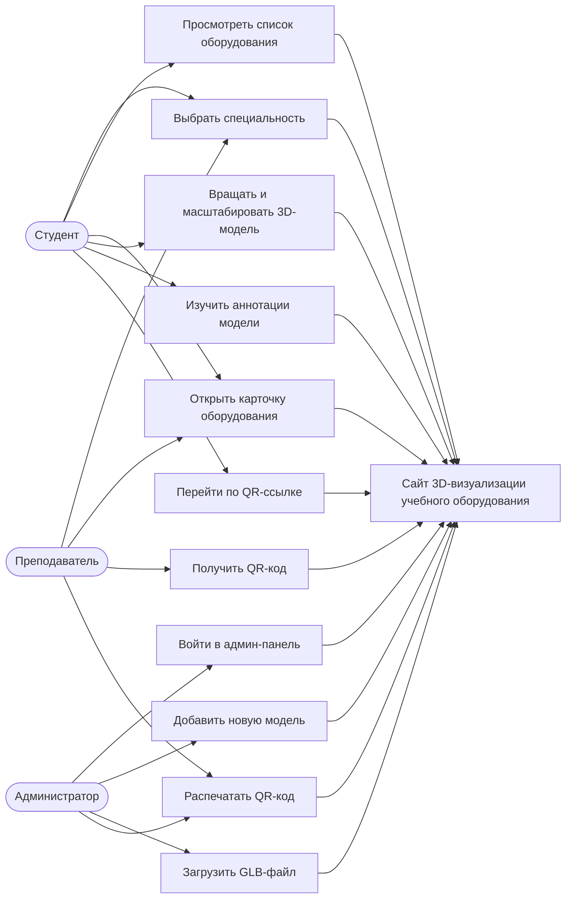
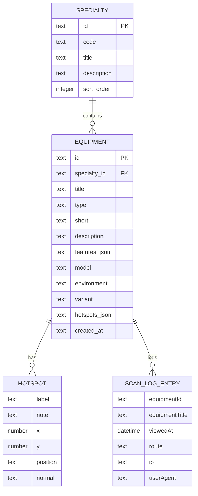
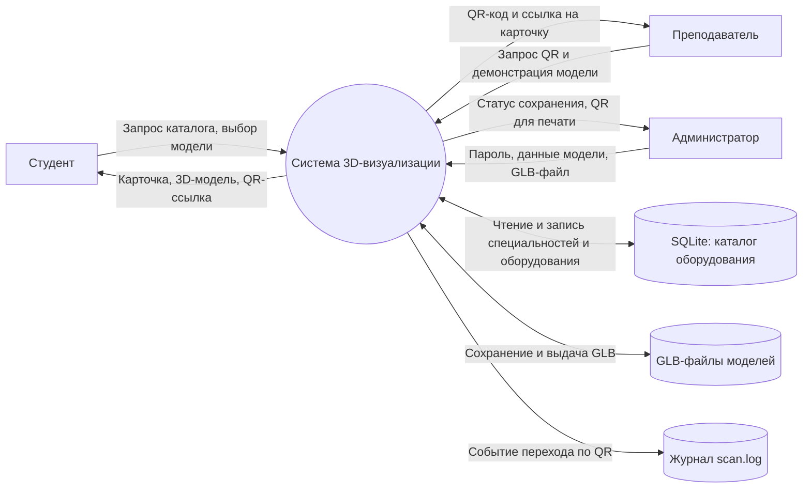
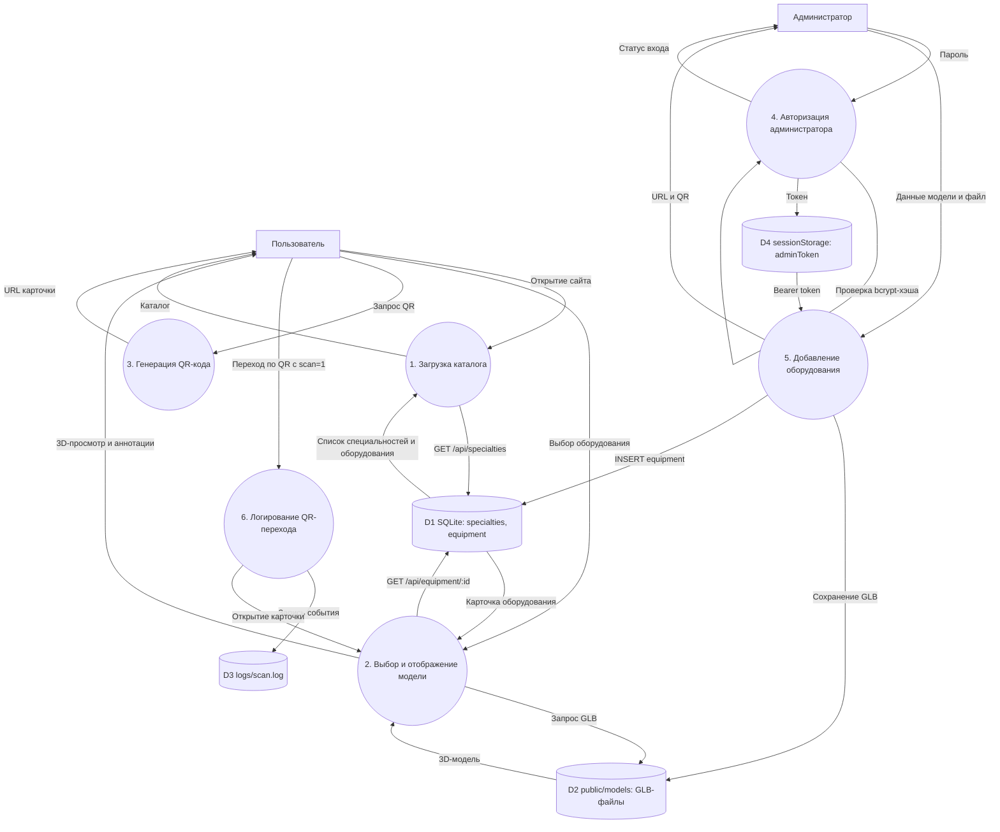
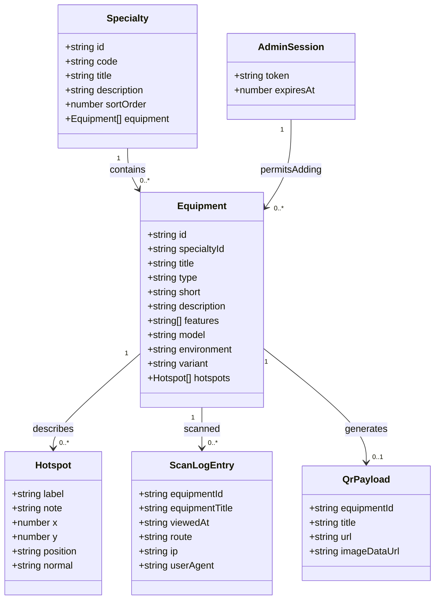
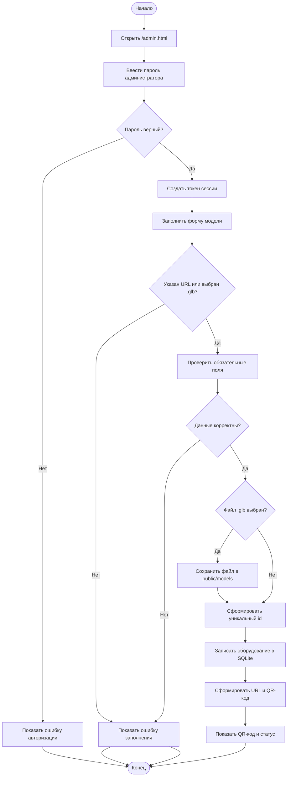
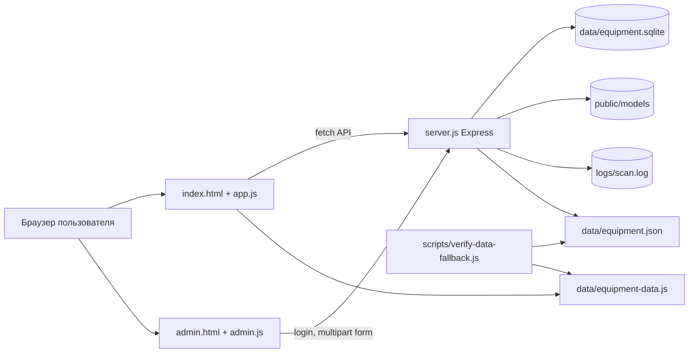

# Отчет по производственной практике

**Обучающийся:** Казаков Владимир Александрович  
**Место прохождения практики:** КГБПОУ "Алтайский Промышленно-Экономический Колледж"  
**Сроки прохождения практики:** 20.04.2026 - 16.05.2026  
**Тема программного изделия:** сайт интерактивной 3D-визуализации учебного оборудования  
**Разработанное программное изделие:** веб-приложение "3D визуализация учебного оборудования"

---

## Содержание

1. Введение
2. Ознакомление с предприятием
3. Характеристика разрабатываемого программного изделия
4. Требования к программному изделию
5. Предпроектное обследование и функциональные требования
6. Информационно-логическая схема данных
7. Функциональная модель предметной области
8. Проектные решения и инструментальные средства
9. Входная и выходная информация, алгоритм решения задачи и контрольный пример
10. Инфологическая модель задачи
11. Алгоритм работы программного изделия в словесной форме
12. Анализ информационных ресурсов и защита данных
13. Резервирование и восстановление данных
14. Модульная структура и отладка
15. Оценка затрат
16. Интерфейс пользователя, справочная система и навигация
17. Система тестирования
18. Документация программиста
19. Заключение
20. Приложения. Код диаграмм Mermaid

---

## 1. Введение

Производственная практика проходила в период с 20.04.2026 по 16.05.2026 в КГБПОУ "Алтайский Промышленно-Экономический Колледж". Целью практики являлось закрепление профессиональных навыков проектирования, разработки, тестирования и документирования программного изделия.

В качестве практической задачи было разработано веб-приложение для интерактивной трехмерной визуализации учебного оборудования. Приложение предназначено для размещения на сервере учебного заведения и позволяет студентам выбирать специальность, открывать карточки оборудования, просматривать 3D-модели, изучать аннотации к элементам модели и получать доступ к карточке через QR-код.

В ходе практики были выполнены следующие виды работ:

- ознакомление с предприятием и предметной областью;
- формулирование требований к программному изделию;
- моделирование требований и процессов с помощью диаграмм;
- проектирование информационной структуры данных;
- разработка серверной и клиентской частей приложения;
- создание административного интерфейса для добавления моделей;
- настройка SQL-хранилища и резервного копирования;
- тестирование программного изделия;
- оформление пользовательской и программистской документации;
- подготовка отчета по практике.

## 2. Ознакомление с предприятием

КГБПОУ "Алтайский Промышленно-Экономический Колледж" является образовательной организацией среднего профессионального образования. В рамках учебного процесса колледж использует материально-техническую базу, учебные стенды, лабораторное оборудование, тренажеры, макеты и демонстрационные материалы.

Для повышения наглядности обучения требуется цифровой инструмент, который позволяет:

- быстро находить учебное оборудование по специальности;
- демонстрировать внешний вид и состав оборудования в интерактивном режиме;
- размещать QR-коды рядом с реальными учебными стендами;
- открывать карточку оборудования на смартфоне или компьютере;
- пополнять каталог новыми 3D-моделями без изменения исходного кода.

В результате ознакомления с предприятием была определена предметная область: цифровой каталог учебного оборудования с 3D-визуализацией для специальностей колледжа.

**Рисунок 1 - Главное окно сайта с выбором специальности и 3D-просмотрщиком.**

## 3. Характеристика разрабатываемого программного изделия

Разработанное программное изделие представляет собой веб-сайт с небольшим Node.js/Express backend и статическими frontend-ресурсами. Проект не требует отдельной сборки и запускается командой `npm start`. Сервер по умолчанию слушает адрес `0.0.0.0:8080`.

Основные возможности приложения:

- каталог специальностей: ОИБ, ПД, ЗЕМ;
- каталог учебного оборудования по каждой специальности;
- интерактивный просмотр 3D-моделей в формате GLB;
- отображение аннотаций к элементам модели;
- управление масштабом и автопрокруткой модели;
- генерация QR-кода для выбранной карточки оборудования;
- административная панель для добавления новых моделей;
- хранение данных в SQLite;
- начальное заполнение базы из файла `data/equipment.json`;
- fallback-файл `data/equipment-data.js` для открытия каталога без сервера;
- логирование переходов по QR-ссылкам в `logs/scan.log`.

На момент обследования в каталоге содержится:

| Показатель | Значение |
| --- | ---: |
| Количество специальностей | 3 |
| Количество объектов оборудования | 9 |
| Количество аннотаций к моделям | 19 |
| Основное хранилище | SQLite |
| Исходный файл данных | `data/equipment.json` |
| Файл fallback-данных | `data/equipment-data.js` |

## 4. Требования к программному изделию

### 4.1. Назначение изделия

Программное изделие предназначено для демонстрации учебного оборудования в интерактивном 3D-формате и обеспечения быстрого доступа к карточкам оборудования через QR-коды.

### 4.2. Пользователи системы

| Роль | Описание |
| --- | --- |
| Студент | Просматривает каталог, выбирает специальность и изучает оборудование. |
| Преподаватель | Использует 3D-модель и QR-код при проведении занятий. |
| Администратор | Добавляет новые модели и заполняет описание оборудования. |

### 4.3. Функциональные требования

| Код | Требование |
| --- | --- |
| FR-01 | Система должна отображать список специальностей. |
| FR-02 | Система должна отображать список оборудования выбранной специальности. |
| FR-03 | Система должна открывать карточку выбранного оборудования. |
| FR-04 | Система должна отображать 3D-модель оборудования в браузере. |
| FR-05 | Система должна поддерживать вращение, масштабирование и автопрокрутку модели. |
| FR-06 | Система должна отображать аннотации к элементам модели. |
| FR-07 | Система должна формировать QR-код для выбранной карточки оборудования. |
| FR-08 | Система должна поддерживать прямую ссылку на оборудование по параметру `id` или маршруту `/equipment/:equipmentId`. |
| FR-09 | Система должна предоставлять администратору вход по паролю. |
| FR-10 | Система должна позволять администратору добавлять новую модель через форму. |
| FR-11 | Система должна принимать URL GLB-модели или файл `.glb`. |
| FR-12 | Система должна сохранять сведения об оборудовании в SQL-базу данных. |
| FR-13 | Система должна возвращать данные каталога через API. |
| FR-14 | Система должна проверять корректность данных и обрабатывать ошибки. |
| FR-15 | Система должна проверять синхронность `equipment.json` и fallback-файла. |

### 4.4. Нефункциональные требования

| Код | Требование |
| --- | --- |
| NFR-01 | Приложение должно запускаться на сервере Linux с установленным Node.js. |
| NFR-02 | Интерфейс должен быть адаптивным и удобным для работы на компьютере и мобильном устройстве. |
| NFR-03 | Сервер должен использовать базовые меры защиты HTTP-заголовков. |
| NFR-04 | Административные операции должны быть доступны только после авторизации. |
| NFR-05 | Загружаемые файлы моделей должны иметь формат `.glb`. |
| NFR-06 | Размер загружаемого файла должен быть ограничен. |
| NFR-07 | Система должна сохранять работоспособность при временной недоступности API за счет fallback-данных. |
| NFR-08 | Каталог должен быть расширяемым без изменения пользовательского интерфейса. |

### 4.5. Диаграмма требований

**Рисунок 2 - Диаграмма вариантов использования программного изделия.**

Mermaid-код диаграммы приведен в приложении А.

## 5. Предпроектное обследование и функциональные требования

Предпроектное обследование включало анализ учебной задачи, состава данных, сценариев пользователей и технических ограничений. Было установлено, что приложение должно быть простым в развертывании, не требовать сложной инфраструктуры и поддерживать пополнение каталога через браузер.

### 5.1. Методы обследования

При обследовании были использованы следующие методы:

- анализ предметной области;
- анализ существующего кода проекта;
- выделение ролей пользователей;
- описание пользовательских сценариев;
- моделирование потоков данных;
- построение информационной модели;
- анализ рисков безопасности и сохранности данных.

### 5.2. Основные пользовательские сценарии

**Сценарий 1. Просмотр оборудования студентом**

1. Пользователь открывает главную страницу.
2. Система загружает список специальностей и оборудования.
3. Пользователь выбирает специальность.
4. Система показывает список оборудования выбранной специальности.
5. Пользователь выбирает объект.
6. Система отображает карточку, 3D-модель, аннотации и ссылку на GLB-источник.

**Сценарий 2. Получение QR-кода**

1. Пользователь открывает карточку оборудования.
2. Пользователь нажимает кнопку "Показать QR-код".
3. Система формирует ссылку на выбранное оборудование.
4. Система генерирует изображение QR-кода и отображает его в модальном окне.

**Сценарий 3. Добавление новой модели администратором**

1. Администратор открывает страницу `/admin.html`.
2. Администратор вводит пароль.
3. Система проверяет пароль и выдает токен сессии.
4. Администратор заполняет форму новой модели.
5. Администратор указывает URL GLB или загружает файл `.glb`.
6. Система валидирует данные и сохраняет запись в SQLite.
7. Система возвращает ссылку на новую модель.
8. Админ-панель формирует QR-код для печати.

## 6. Информационно-логическая схема данных

Информационная структура программного изделия строится вокруг двух основных сущностей: специальность и оборудование. Каждая специальность содержит несколько объектов оборудования. Оборудование имеет описание, характеристики, путь к 3D-модели и набор аннотаций.

### 6.1. Таблицы базы данных

В приложении используется SQLite-база `data/equipment.sqlite`. При первом запуске она создается автоматически на основании данных из `data/equipment.json`.

**Таблица `specialties`**

| Поле | Тип | Назначение |
| --- | --- | --- |
| `id` | TEXT, PK | Уникальный идентификатор специальности. |
| `code` | TEXT | Краткий код специальности, например ОИБ. |
| `title` | TEXT | Полное название специальности. |
| `description` | TEXT | Описание направления. |
| `sort_order` | INTEGER | Порядок отображения. |

**Таблица `equipment`**

| Поле | Тип | Назначение |
| --- | --- | --- |
| `id` | TEXT, PK | Уникальный идентификатор оборудования. |
| `specialty_id` | TEXT, FK | Ссылка на специальность. |
| `title` | TEXT | Название оборудования. |
| `type` | TEXT | Тип или категория оборудования. |
| `short` | TEXT | Краткое описание. |
| `description` | TEXT | Полное описание. |
| `features_json` | TEXT | JSON-массив особенностей. |
| `model` | TEXT | URL или локальный путь к GLB-модели. |
| `environment` | TEXT | Окружение отображения модели. |
| `variant` | TEXT | Вариант локальной 3D-формы. |
| `hotspots_json` | TEXT | JSON-массив аннотаций. |
| `created_at` | TEXT | Дата создания записи. |

### 6.2. Информационно-логическая схема

**Рисунок 3 - Информационно-логическая схема базы данных.**

Mermaid-код ER-диаграммы приведен в приложении Б.

## 7. Функциональная модель предметной области

Функциональная модель отражает взаимодействие пользователя, браузера, серверного API, базы данных и файловой системы.

Основные процессы:

1. загрузка каталога специальностей;
2. выбор оборудования;
3. получение детальной карточки оборудования;
4. отображение 3D-модели;
5. генерация QR-кода;
6. авторизация администратора;
7. добавление оборудования;
8. загрузка файла модели;
9. логирование переходов по QR-ссылке.

### 7.1. Контекстная DFD

**Рисунок 4 - Контекстная диаграмма потоков данных.**

Mermaid-код контекстной DFD приведен в приложении В.

### 7.2. DFD первого уровня

**Рисунок 5 - DFD первого уровня для программного изделия.**

Mermaid-код DFD первого уровня приведен в приложении Г.

### 7.3. Диаграмма классов

В JavaScript-проекте отсутствуют отдельные классы предметной области, однако логические структуры можно представить в виде классов: `Specialty`, `Equipment`, `Hotspot`, `AdminSession`, `QrPayload`, `ScanLogEntry`.

**Рисунок 6 - Диаграмма классов предметной области.**

Mermaid-код диаграммы классов приведен в приложении Д.

## 8. Проектные решения и инструментальные средства

### 8.1. Архитектурное решение

Приложение реализовано как монолитный Node.js-сервер со статическим frontend. Такой подход выбран потому, что задача не требует сложной микросервисной инфраструктуры, а сайт должен легко запускаться на сервере учебного заведения.

Архитектура включает:

- `server.js` - Express-сервер, REST API, работа с SQLite, авторизация администратора, загрузка файлов, генерация QR;
- `index.html` - главная страница каталога;
- `app.js` - логика публичного интерфейса;
- `admin.html` - страница администрирования;
- `admin.js` - логика входа администратора, добавления моделей и печати QR;
- `styles.css` - визуальное оформление и адаптивность интерфейса;
- `data/equipment.json` - исходные данные каталога;
- `data/equipment-data.js` - fallback-данные для браузера;
- `scripts/verify-data-fallback.js` - проверка синхронизации данных;
- `public/models/` - каталог для загружаемых `.glb`-моделей;
- `logs/scan.log` - журнал переходов по QR-ссылкам.

### 8.2. Обоснование инструментальных средств

| Средство | Назначение | Обоснование |
| --- | --- | --- |
| Node.js | Среда выполнения JavaScript | Позволяет использовать один язык на сервере и клиенте. |
| Express | Веб-сервер и маршрутизация API | Простая настройка маршрутов и статических файлов. |
| SQLite | Локальная SQL-база данных | Не требует отдельного сервера БД, подходит для учебного проекта. |
| `sqlite3` | Доступ к SQLite из Node.js | Позволяет выполнять SQL-запросы из backend-кода. |
| `multer` | Загрузка файлов | Используется для загрузки `.glb`-моделей через админ-панель. |
| `bcrypt` | Проверка пароля | Пароль администратора хранится в виде хэша. |
| `helmet` | Защитные HTTP-заголовки | Повышает базовую безопасность Express-приложения. |
| `express-rate-limit` | Ограничение частоты запросов | Снижает риск перебора и перегрузки сервера. |
| `compression` | Сжатие HTTP-ответов | Уменьшает объем передаваемых данных. |
| `qrcode` | Генерация QR-кодов | Формирует QR-ссылки на карточки оборудования. |
| `<model-viewer>` | 3D-просмотр GLB | Позволяет отображать модели прямо в браузере. |
| Mermaid | Диаграммы | Удобен для текстового описания моделей и процессов. |

### 8.3. Описание функций и параметров программных средств

Основные серверные маршруты:

| Метод и маршрут | Назначение |
| --- | --- |
| `GET /api/specialties` | Возвращает список специальностей с оборудованием. |
| `GET /api/equipment` | Возвращает общий список оборудования. |
| `GET /api/equipment/:equipmentId` | Возвращает карточку конкретного оборудования. |
| `GET /api/qr/:equipmentId` | Возвращает QR-код для оборудования в формате data URL. |
| `POST /api/admin/login` | Проверяет пароль администратора и выдает токен. |
| `GET /api/admin/specialties` | Возвращает список специальностей для формы администратора. |
| `POST /api/admin/equipment` | Добавляет новую модель оборудования. |
| `GET /equipment/:equipmentId` | Открывает публичную страницу с выбранным оборудованием. |

Важные параметры окружения:

| Параметр | Назначение |
| --- | --- |
| `PORT` | Порт запуска сервера, по умолчанию 8080. |
| `HOST` | Адрес прослушивания, по умолчанию `0.0.0.0`. |
| `ADMIN_PASSWORD_HASH` | Bcrypt-хэш пароля администратора. |
| `PUBLIC_BASE_URL` | Публичный базовый URL для QR-ссылок. |

## 9. Входная и выходная информация, алгоритм решения задачи и контрольный пример

### 9.1. Входная информация

| Источник | Данные | Формат |
| --- | --- | --- |
| Пользовательский интерфейс | Выбор специальности и оборудования | События браузера |
| Адресная строка | Идентификатор оборудования | Query-параметр `id` или путь `/equipment/:id` |
| Админ-форма | Название, тип, описание, особенности, модель | HTML form data |
| Загружаемый файл | 3D-модель | `.glb` |
| Исходный каталог | Начальные данные | JSON |

### 9.2. Выходная информация

| Получатель | Данные | Формат |
| --- | --- | --- |
| Пользователь | Карточка оборудования | HTML |
| Пользователь | 3D-модель | GLB в `<model-viewer>` |
| Пользователь | QR-код | PNG/data URL или canvas |
| Администратор | Статус сохранения | Сообщение интерфейса |
| База данных | Новая запись оборудования | SQL-запись |
| Журнал | Данные перехода по QR | JSON-строка в `logs/scan.log` |

### 9.3. Контрольный пример

**Условие:** необходимо добавить в каталог новую модель "Учебный датчик температуры" для специальности ОИБ.

**Входные данные:**

| Поле | Значение |
| --- | --- |
| Специальность | ОИБ |
| Название модели | Учебный датчик температуры |
| Тип | ОИБ · датчики |
| Краткое описание | Демонстрационный датчик температуры для лабораторных работ |
| Полное описание | Модель показывает корпус датчика, зону измерения и подключение к системе мониторинга |
| Особенности | Изучение устройства; просмотр зоны измерения; QR-доступ |
| Модель | URL GLB или файл `.glb` |

**Ожидаемый результат:**

1. Система принимает данные формы.
2. Система формирует идентификатор, например `uchebnyy-datchik-temperatury`.
3. Запись сохраняется в таблицу `equipment`.
4. В каталоге ОИБ появляется новый объект.
5. Для объекта формируется ссылка вида `http://server:8080/?id=uchebnyy-datchik-temperatury&scan=1`.
6. На экране администратора появляется QR-код для печати.

**Рисунок 7 - Контрольный пример добавления новой модели в админ-панели.**

## 10. Инфологическая модель задачи

Инфологическая модель описывает сущности предметной области без привязки к конкретной СУБД.

### 10.1. Сущности

**Специальность**

- идентификатор;
- код;
- название;
- описание;
- порядок отображения.

**Оборудование**

- идентификатор;
- специальность;
- название;
- тип;
- краткое описание;
- полное описание;
- особенности;
- ссылка на модель;
- вариант отображения;
- окружение;
- дата создания.

**Аннотация**

- название точки;
- пояснение;
- координаты на модели или в fallback-сцене;
- нормаль поверхности для `model-viewer`.

**Административная сессия**

- токен;
- время истечения.

**Журнал сканирования**

- идентификатор оборудования;
- название оборудования;
- дата просмотра;
- маршрут;
- IP-адрес;
- user-agent браузера.

### 10.2. Связи

- одна специальность содержит много объектов оборудования;
- один объект оборудования содержит много аннотаций;
- один объект оборудования может иметь много записей журнала сканирования;
- административная сессия разрешает выполнение операций добавления оборудования.

## 11. Алгоритм работы программного изделия в словесной форме

### 11.1. Запуск системы

1. Администратор запускает сервер командой `npm start`.
2. Сервер создает каталог `public/models`, если он отсутствует.
3. Сервер открывает SQLite-базу `data/equipment.sqlite`.
4. Сервер создает таблицы `specialties` и `equipment`, если они отсутствуют.
5. Если база пустая, сервер заполняет ее данными из `data/equipment.json`.
6. Сервер настраивает middleware: защитные заголовки, ограничение частоты запросов, сжатие, JSON-парсер, статические файлы.
7. Сервер начинает слушать порт 8080.

### 11.2. Просмотр модели пользователем

1. Браузер открывает главную страницу.
2. Клиентский скрипт `app.js` определяет режим работы: серверный режим или открытие из файла.
3. В серверном режиме скрипт запрашивает `/api/specialties`.
4. При ошибке API скрипт использует fallback-данные из `data/equipment-data.js`.
5. Скрипт выводит карточки специальностей.
6. После выбора специальности выводится список оборудования.
7. После выбора оборудования запрашивается детальная карточка `/api/equipment/:id`.
8. Данные карточки выводятся в интерфейс.
9. GLB-модель подключается к элементу `<model-viewer>`.
10. Аннотации добавляются как hotspots.
11. Пользователь вращает и масштабирует модель.

### 11.3. Генерация QR-кода

1. Пользователь нажимает кнопку "Показать QR-код".
2. Скрипт формирует URL с идентификатором оборудования и параметром `scan=1`.
3. Библиотека QR-кода создает изображение.
4. QR-код выводится в модальном окне.
5. При переходе по QR-ссылке сервер записывает событие просмотра в журнал.

### 11.4. Добавление модели администратором

1. Администратор открывает `/admin.html`.
2. Администратор вводит пароль.
3. Сервер сравнивает пароль с bcrypt-хэшем.
4. При успешной проверке сервер создает токен сессии.
5. Админ-панель сохраняет токен в `sessionStorage`.
6. Администратор заполняет форму новой модели.
7. Если выбран файл, `multer` сохраняет его в `public/models`.
8. Сервер проверяет обязательные поля и формат файла.
9. Сервер генерирует уникальный `id` на основе названия.
10. Запись добавляется в таблицу `equipment`.
11. Сервер возвращает идентификатор, название и URL.
12. Админ-панель показывает QR-код для новой модели.

**Рисунок 8 - Блок-схема алгоритма добавления новой модели.**

Mermaid-код блок-схемы приведен в приложении Е.

## 12. Анализ информационных ресурсов и защита данных

### 12.1. Категорирование информационных ресурсов

| Ресурс | Содержание | Категория конфиденциальности |
| --- | --- | --- |
| Каталог специальностей | Коды, названия и описания специальностей | Открытая информация |
| Карточки оборудования | Описания, особенности, ссылки на модели | Открытая или внутренняя учебная информация |
| GLB-модели | 3D-файлы оборудования | Внутренняя учебная информация |
| Пароль администратора | Доступ к добавлению моделей | Конфиденциальная информация |
| Токен администратора | Временная административная сессия | Конфиденциальная информация |
| Журнал сканирования | IP-адрес, user-agent, дата просмотра | Персональные/технические данные ограниченного доступа |
| SQLite-база | Структурированный каталог оборудования | Внутренняя информация |

### 12.2. Основные угрозы

| Угроза | Возможные последствия | Меры нейтрализации |
| --- | --- | --- |
| Подбор пароля администратора | Несанкционированное добавление данных | Bcrypt-хэш, ограничение частоты запросов, сложный пароль через переменную окружения. |
| Загрузка вредоносного файла | Нарушение работы сервера или клиента | Разрешение только `.glb`, ограничение размера файла, хранение в отдельном каталоге. |
| XSS через пользовательские поля | Выполнение вредоносного кода в браузере | Экранирование HTML в `app.js`, контролируемая вставка данных. |
| SQL-инъекция | Повреждение или чтение данных | Параметризованные SQL-запросы. |
| Утечка пароля | Захват админ-доступа | Хранение хэша вместо открытого пароля, замена пароля через окружение. |
| Перегрузка сервера запросами | Отказ в обслуживании | `express-rate-limit`, сжатие ответов. |
| Потеря базы данных | Потеря каталога и новых моделей | Регулярное резервное копирование SQLite и `public/models`. |
| Раскрытие лишних HTTP-возможностей | Повышение риска атак | Использование `helmet`, настройка CSP. |

### 12.3. Реализованные меры защиты

В проекте реализованы следующие меры:

- пароль администратора сравнивается с bcrypt-хэшем;
- административные запросы требуют bearer-токен;
- срок действия административной сессии ограничен 24 часами;
- включены защитные HTTP-заголовки через `helmet`;
- используется Content Security Policy;
- включено ограничение частоты запросов;
- загружаемые файлы ограничены форматом `.glb`;
- максимальный размер файла ограничен 100 МБ;
- SQL-запросы выполняются с параметрами;
- идентификатор оборудования проверяется регулярным выражением;
- данные, вставляемые в HTML, экранируются на клиенте.

## 13. Резервирование и восстановление данных

Для сохранности данных требуется резервировать:

- `data/equipment.sqlite` - основную SQLite-базу;
- `data/equipment.json` - исходные данные для первичного заполнения;
- `data/equipment-data.js` - fallback-данные;
- `public/models/` - загруженные GLB-модели;
- `logs/scan.log` - журнал переходов по QR-ссылкам, если он используется для анализа.

### 13.1. Пример резервного копирования

```bash
mkdir -p backups
cp data/equipment.sqlite backups/equipment-$(date +%Y%m%d-%H%M%S).sqlite
cp data/equipment.json backups/equipment-$(date +%Y%m%d-%H%M%S).json
tar -czf backups/models-$(date +%Y%m%d-%H%M%S).tar.gz public/models
```

### 13.2. Пример восстановления

```bash
cp backups/equipment-YYYYMMDD-HHMMSS.sqlite data/equipment.sqlite
tar -xzf backups/models-YYYYMMDD-HHMMSS.tar.gz
npm start
```

### 13.3. Проверка после восстановления

После восстановления необходимо:

1. запустить `npm start`;
2. открыть главную страницу;
3. проверить список специальностей;
4. открыть несколько карточек оборудования;
5. проверить отображение локально загруженных моделей;
6. выполнить `npm test`.

## 14. Модульная структура и отладка

### 14.1. Разделение задачи на модули

| Модуль | Файл | Функции |
| --- | --- | --- |
| Сервер и API | `server.js` | Маршруты, SQLite, авторизация, QR, загрузка файлов, статические ресурсы. |
| Публичный интерфейс | `index.html` | Разметка каталога, просмотрщика, QR-модального окна. |
| Клиентская логика | `app.js` | Загрузка данных, выбор модели, рендер карточек, hotspots, QR. |
| Админ-интерфейс | `admin.html` | Форма входа и форма добавления модели. |
| Админ-логика | `admin.js` | Авторизация, отправка формы, генерация QR для печати. |
| Стили | `styles.css` | Адаптивное оформление, карточки, модальные окна, 3D-сцена. |
| Данные | `data/equipment.json` | Исходный каталог специальностей и оборудования. |
| Fallback-данные | `data/equipment-data.js` | Браузерная копия каталога. |
| Проверка данных | `scripts/verify-data-fallback.js` | Контроль синхронизации JSON и fallback. |

### 14.2. Отладка

Отладка выполнялась поэтапно:

1. Проверка запуска сервера.
2. Проверка создания SQLite-базы.
3. Проверка API через браузер и маршруты `/api/specialties`, `/api/equipment/:id`.
4. Проверка отображения каталога и переключения специальностей.
5. Проверка прямых ссылок на оборудование.
6. Проверка генерации QR-кода.
7. Проверка входа администратора.
8. Проверка добавления записи через админ-панель.
9. Проверка синтаксиса JavaScript.
10. Проверка синхронности fallback-данных.

## 15. Оценка затрат

Оценка затрат выполнена для учебного проекта и показывает основные статьи расходов.

### 15.1. Технические затраты

| Статья | Значение |
| --- | --- |
| Среда разработки | Бесплатная |
| Node.js | Бесплатно |
| Express и npm-пакеты | Бесплатно |
| SQLite | Бесплатно |
| Mermaid | Бесплатно |
| Сервер колледжа | Используется имеющаяся инфраструктура |
| Домен | Не обязателен при размещении во внутренней сети |

### 15.2. Трудовые затраты

| Вид работ | Содержание |
| --- | --- |
| Анализ | Изучение предметной области, ролей пользователей и данных. |
| Проектирование | Требования, DFD, модель данных, структура модулей. |
| Разработка backend | API, SQLite, авторизация, загрузка файлов, QR. |
| Разработка frontend | Каталог, 3D-просмотр, hotspots, модальные окна. |
| Разработка админ-панели | Вход, форма добавления модели, печать QR. |
| Тестирование | Синтаксис, данные, ручные пользовательские сценарии. |
| Документирование | Отчет, диаграммы, инструкция программиста. |

### 15.3. Вывод по затратам

Проект имеет низкую стоимость внедрения, так как использует свободно распространяемые программные средства и может быть размещен на имеющемся сервере колледжа. Основная часть затрат связана с разработкой, подготовкой 3D-моделей и сопровождением каталога.

## 16. Интерфейс пользователя, справочная система и навигация

### 16.1. Дружественный интерфейс

Публичный интерфейс построен как пошаговый сценарий:

1. выбор специальности;
2. выбор оборудования;
3. просмотр 3D-модели;
4. получение QR-кода.

Для удобства пользователя реализованы:

- крупный заголовок и описание назначения сайта;
- верхняя навигация по разделам;
- карточки специальностей;
- список оборудования;
- отдельная зона 3D-просмотра;
- кнопки масштабирования;
- переключатель автопрокрутки;
- аннотации на модели;
- модальное окно QR-кода;
- адаптивная верстка для разных размеров экрана.

**Рисунок 9 - Карточка оборудования с 3D-моделью и аннотациями.**

### 16.2. Справочная система

Справочная информация встроена в интерфейс:

- вводные блоки объясняют назначение сайта;
- разделы "Шаг 1", "Шаг 2", "Шаг 3" объясняют порядок работы;
- подсказка в просмотрщике сообщает, как вращать и масштабировать модель;
- аннотации поясняют элементы модели;
- в админ-панели указано, что можно загрузить файл `.glb` или указать URL;
- в админ-панели выводятся сообщения о статусе сохранения и ошибках.

### 16.3. Организация навигации

Навигация реализована несколькими способами:

- верхнее меню: "Специальности", "3D модель", "QR", "Админ";
- якорные ссылки внутри главной страницы;
- история браузера при выборе оборудования;
- query-параметр `id` для открытия конкретной модели;
- маршрут `/equipment/:equipmentId`;
- QR-ссылка на конкретную карточку.

**Рисунок 10 - Административная панель добавления новой модели.**

## 17. Система тестирования

В проекте предусмотрен npm-скрипт `npm test`, который выполняет:

1. синтаксическую проверку `app.js`;
2. синтаксическую проверку `admin.js`;
3. синтаксическую проверку `server.js`;
4. синтаксическую проверку `scripts/verify-data-fallback.js`;
5. проверку синхронности `data/equipment.json` и `data/equipment-data.js`.

Команда запуска:

```bash
npm test
```

### 17.1. Ручные тестовые сценарии

| Номер | Проверка | Ожидаемый результат |
| --- | --- | --- |
| T-01 | Открыть главную страницу | Отображается каталог специальностей. |
| T-02 | Выбрать специальность ОИБ | Список оборудования меняется на объекты ОИБ. |
| T-03 | Выбрать IP-камеру | Открывается карточка IP-камеры и 3D-модель. |
| T-04 | Нажать hotspot | Отображается пояснение к элементу модели. |
| T-05 | Нажать "Показать QR-код" | Открывается модальное окно с QR-кодом. |
| T-06 | Открыть ссылку с `?id=ip-camera` | Сразу открывается карточка IP-камеры. |
| T-07 | Открыть `/admin.html` без входа | Форма добавления не загружает специальности. |
| T-08 | Войти с верным паролем | Загружается список специальностей. |
| T-09 | Добавить модель без URL и файла | Выводится сообщение об ошибке. |
| T-10 | Добавить модель с корректными данными | Запись сохраняется, QR-код готов к печати. |

## 18. Документация программиста

### 18.1. Установка

```bash
npm install
```

### 18.2. Запуск

```bash
npm start
```

После запуска сайт доступен по адресу:

```text
http://localhost:8080
```

Административная панель:

```text
http://localhost:8080/admin.html
```

### 18.3. Настройка пароля администратора

В проекте используется bcrypt-хэш пароля. По умолчанию пароль администратора - `admin123`. Для эксплуатации необходимо задать собственный хэш через переменную окружения:

```bash
ADMIN_PASSWORD_HASH="bcrypt-hash" npm start
```

### 18.4. Структура данных

Начальный каталог находится в `data/equipment.json`. При первом запуске данные переносятся в SQLite. Если база уже содержит специальности, повторное заполнение не выполняется.

После изменения `data/equipment.json` необходимо обновить `data/equipment-data.js`, чтобы fallback-данные совпадали с основным JSON.

### 18.5. Добавление 3D-моделей

Модель можно добавить двумя способами:

1. указать внешний URL на `.glb`;
2. загрузить локальный файл `.glb` через админ-панель.

Загруженные файлы сохраняются в:

```text
public/models/
```

### 18.6. Проверка

```bash
npm test
```

### 18.7. Основные файлы проекта

| Файл | Назначение |
| --- | --- |
| `server.js` | Сервер, база данных, API, авторизация, QR, загрузка файлов. |
| `app.js` | Публичная клиентская логика. |
| `admin.js` | Клиентская логика админ-панели. |
| `index.html` | Главная страница. |
| `admin.html` | Административная страница. |
| `styles.css` | Стили интерфейса. |
| `data/equipment.json` | Исходные данные. |
| `scripts/verify-data-fallback.js` | Проверка fallback-данных. |

## 19. Заключение

В ходе производственной практики было разработано программное изделие для интерактивной 3D-визуализации учебного оборудования. Проект решает практическую задачу колледжа: предоставляет студентам и преподавателям удобный цифровой каталог, поддерживает просмотр 3D-моделей, аннотации и QR-доступ к карточкам оборудования.

В процессе выполнения практики были сформулированы требования, построены модели данных и процессов, реализованы пользовательский и административный интерфейсы, настроено SQL-хранилище, выполнены мероприятия по защите данных, описаны резервное копирование, тестирование и сопровождение.

Разработанное приложение может использоваться как основа для дальнейшего развития: добавления новых специальностей, загрузки собственных 3D-моделей колледжа, расширения справочной информации и интеграции с внутренними ресурсами образовательной организации.

---

# 20. Приложения. Код диаграмм Mermaid

## Приложение А. Диаграмма вариантов использования



## Приложение Б. ER-диаграмма данных



## Приложение В. Контекстная DFD



## Приложение Г. DFD первого уровня



## Приложение Д. Диаграмма классов



## Приложение Е. Блок-схема добавления новой модели



## Приложение Ж. Диаграмма компонентов проекта



