# Диаграммы и формы по проекту

Проект: сайт интерактивной 3D-визуализации учебного оборудования.  
Назначение: каталог специальностей и учебного оборудования с 3D-просмотром, QR-доступом, SQLite-хранилищем и административной панелью.

Ниже приведены готовые диаграммы и модели для вставки в отчет. Для диаграмм используется Mermaid. Если в редакторе Mermaid нет отдельной нотации IDEF0, контекстная и декомпозиционная диаграммы IDEF0 оформлены через `flowchart` с сохранением логики ICOM: входы, управления, выходы, механизмы.

---

## 1. Диаграмма пакетов

**Рисунок 1 - Диаграмма пакетов программного изделия.**

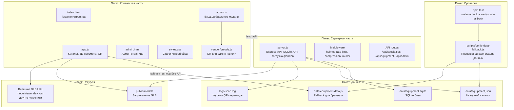

---

## 2. Диаграмма развертывания

**Рисунок 2 - Диаграмма развертывания веб-приложения.**

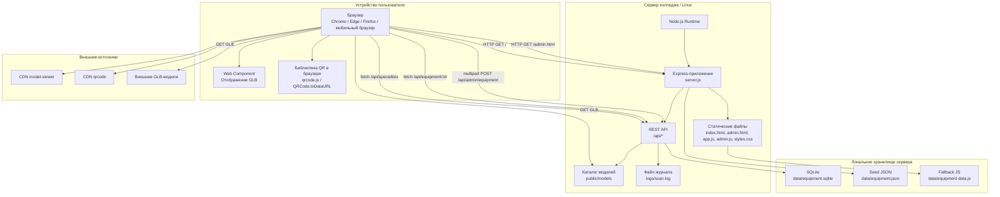

---

## 3. Контекстная диаграмма IDEF0

**Рисунок 3 - Контекстная диаграмма IDEF0 A-0 "Обеспечить 3D-визуализацию учебного оборудования".**

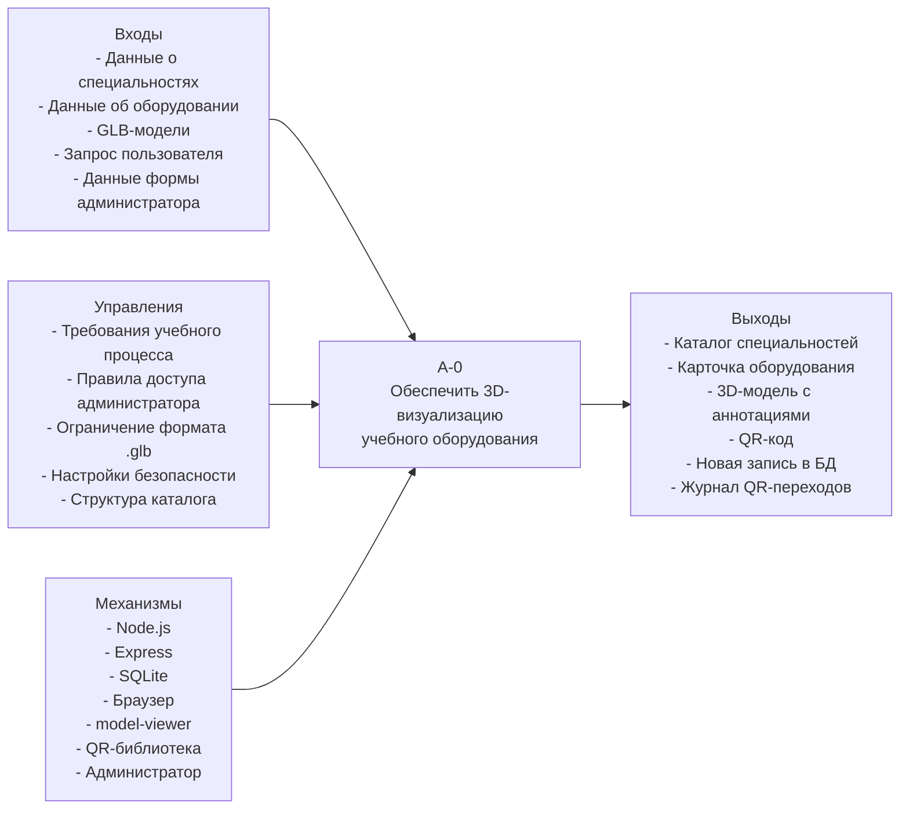

### Форма IDEF0 A-0

| Элемент IDEF0 | Содержание |
| --- | --- |
| Функция | Обеспечить 3D-визуализацию учебного оборудования |
| Входы | Данные о специальностях, данные об оборудовании, GLB-модели, запросы пользователей, данные форм администратора |
| Управления | Требования учебного процесса, правила авторизации, ограничения формата и размера файлов, структура каталога, настройки безопасности |
| Выходы | Каталог, карточка оборудования, 3D-просмотр, QR-код, новая запись оборудования, журнал переходов |
| Механизмы | Node.js, Express, SQLite, браузер, model-viewer, QR-библиотека, администратор |

---

## 4. Диаграмма декомпозиции IDEF0

**Рисунок 4 - Декомпозиция IDEF0 A0 "Работа сайта 3D-визуализации".**

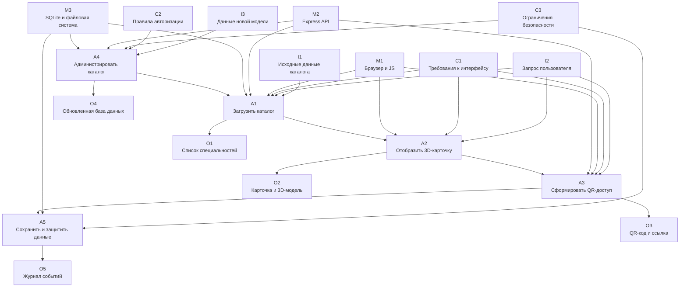

### Форма декомпозиции IDEF0 A0

| Блок | Название | Входы | Управления | Выходы | Механизмы |
| --- | --- | --- | --- | --- | --- |
| A1 | Загрузить каталог | Исходные данные, запрос пользователя | Требования к интерфейсу | Список специальностей и оборудования | Браузер, Express, SQLite |
| A2 | Отобразить 3D-карточку | Выбранное оборудование | Требования к интерфейсу | Карточка, 3D-модель, аннотации | Браузер, app.js, model-viewer |
| A3 | Сформировать QR-доступ | Идентификатор оборудования | Правила формирования URL | QR-код, прямая ссылка | QR-библиотека, Express |
| A4 | Администрировать каталог | Данные новой модели, GLB-файл | Авторизация, ограничения файлов | Новая запись, сохраненный файл | admin.js, Express, multer, SQLite |
| A5 | Сохранить и защитить данные | События и записи каталога | Политики безопасности | Журнал, защищенное хранилище | helmet, rate-limit, SQLite, файловая система |

---

## 5. Диаграмма декомпозиции DFD

**Рисунок 5 - Декомпозиция DFD процесса "Обработать работу с оборудованием".**

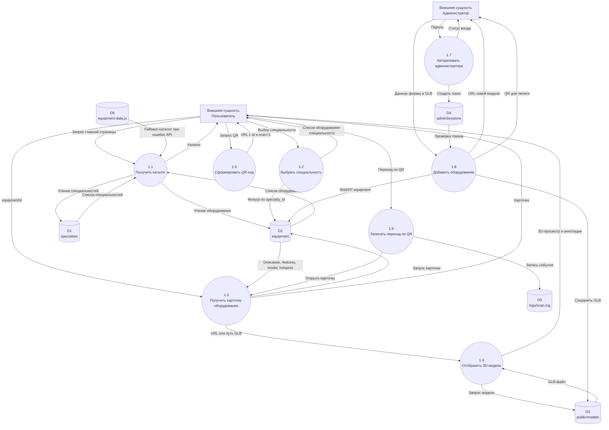

---

## 6. Диаграмма вариантов использования

**Рисунок 6 - Диаграмма вариантов использования сайта.**

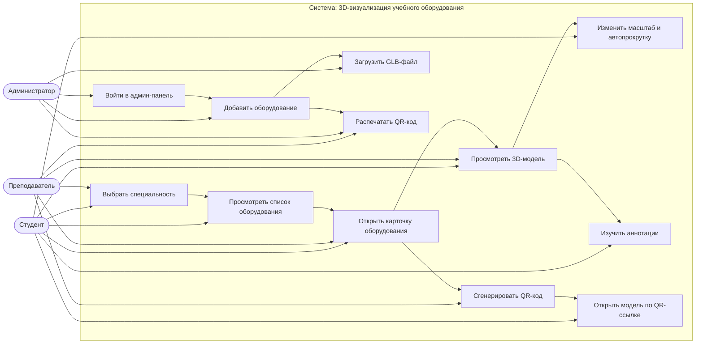

---

## 7. Диаграмма деятельности

**Рисунок 7 - Диаграмма деятельности основного пользовательского сценария.**

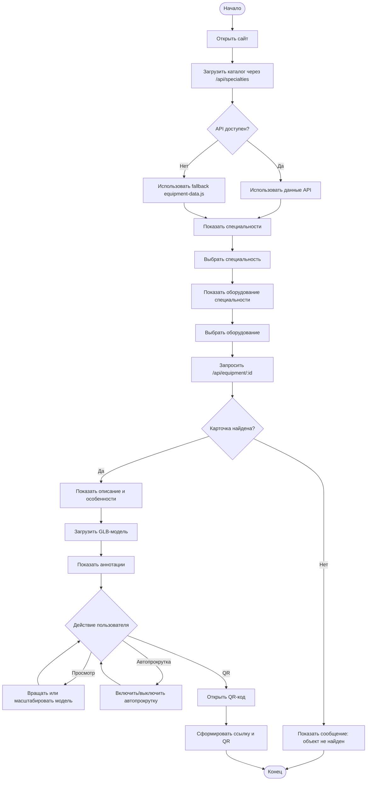

---

## 8. ER-диаграмма

**Рисунок 8 - ER-диаграмма предметной области и хранилища.**

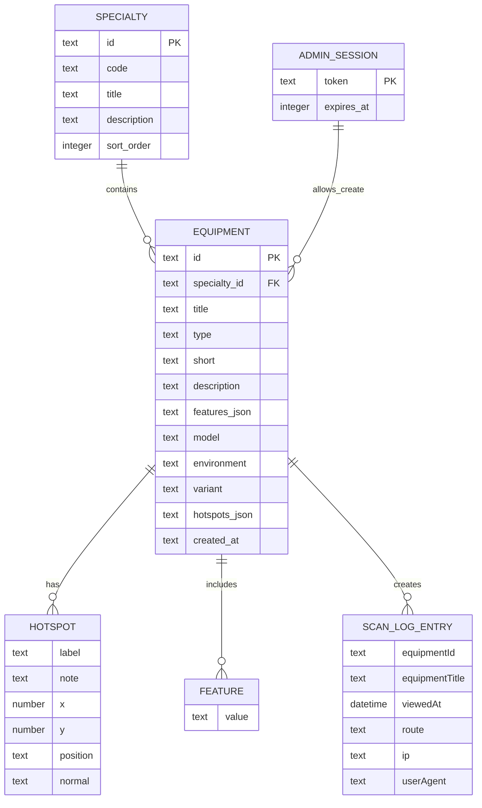

---

## 9. Логическая модель данных

**Рисунок 9 - Логическая модель данных.**

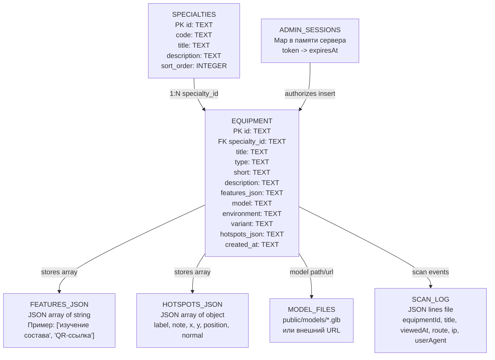

### Табличная форма логической модели

| Объект | Хранилище | Ключ | Связи |
| --- | --- | --- | --- |
| Специальность | `specialties` | `id` | Одна специальность содержит много объектов оборудования |
| Оборудование | `equipment` | `id` | Каждая запись относится к одной специальности |
| Особенности | `features_json` | Не выделен в отдельную таблицу | JSON-массив внутри `equipment` |
| Аннотации | `hotspots_json` | Не выделен в отдельную таблицу | JSON-массив внутри `equipment` |
| Админ-сессия | `adminSessions` в памяти | `token` | Разрешает административные запросы |
| Журнал сканирования | `logs/scan.log` | Время события + equipmentId | Связан с оборудованием по `equipmentId` |
| GLB-модель | `public/models` или внешний URL | Имя файла/URL | Используется записью `equipment.model` |

---

## 10. Диаграмма потоков данных

**Рисунок 10 - Диаграмма потоков данных верхнего уровня.**

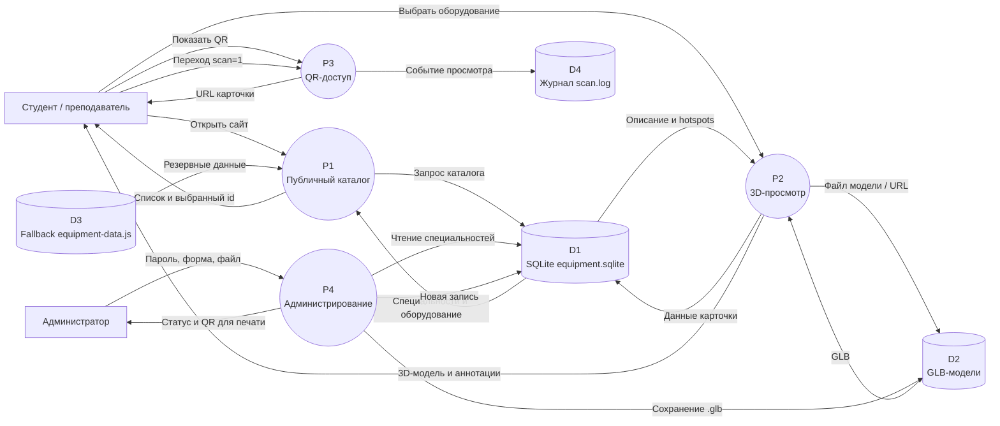

---

## 11. Диаграмма классов

**Рисунок 11 - Диаграмма классов предметной области.**

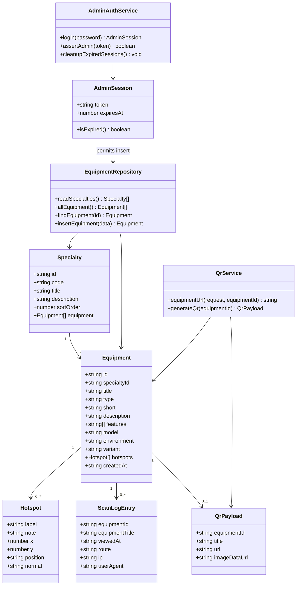

---

## 12. Алгоритм решения задачи: основной сценарий - просмотр оборудования

**Рисунок 12 - Алгоритм просмотра оборудования.**

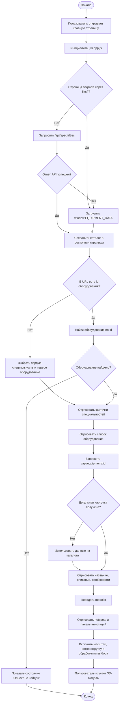

### Словесная форма алгоритма

1. Пользователь открывает главную страницу сайта.
2. Скрипт `app.js` проверяет режим запуска: серверный режим или открытие HTML-файла напрямую.
3. В серверном режиме выполняется запрос `/api/specialties`.
4. Если API недоступен, используются fallback-данные `window.EQUIPMENT_DATA`.
5. Система определяет активное оборудование: из URL-параметра `id`, маршрута `/equipment/:id` или выбирает первый объект каталога.
6. Отрисовываются карточки специальностей и список оборудования.
7. Для выбранного оборудования выполняется запрос `/api/equipment/:id`.
8. Если детальная карточка доступна, используются данные API; иначе берутся данные из уже загруженного каталога.
9. В интерфейс выводятся название, тип, описание и особенности оборудования.
10. В элемент `<model-viewer>` передается путь или URL GLB-модели.
11. На модель добавляются аннотации `hotspots`.
12. Пользователь вращает, масштабирует модель, включает или выключает автопрокрутку и изучает пояснения.

---

## 13. Инфологическая модель

**Рисунок 13 - Инфологическая модель предметной области.**

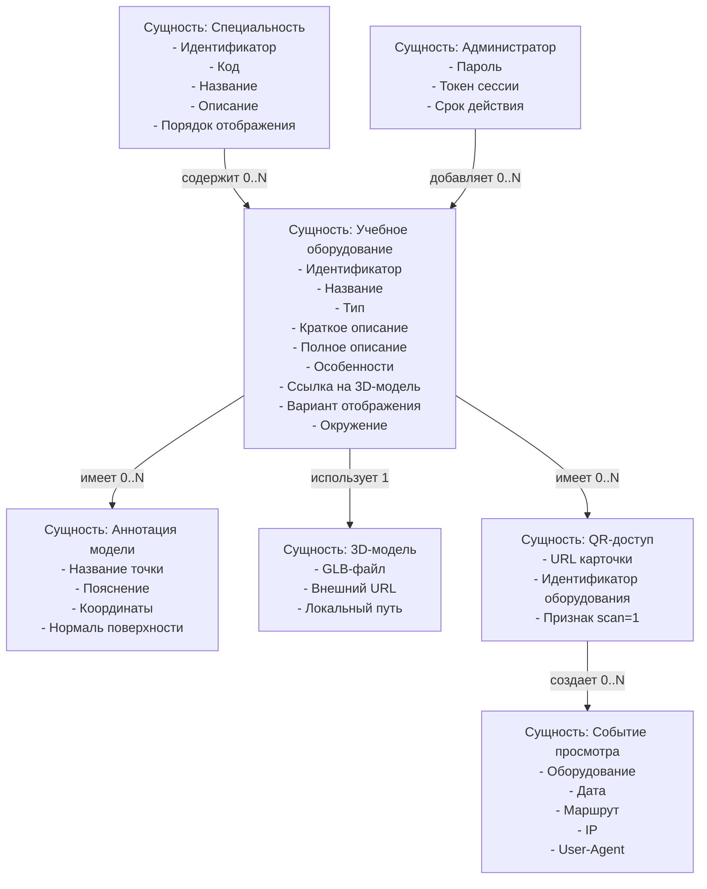

### Табличная форма инфологической модели

| Сущность | Назначение | Основные атрибуты | Связи |
| --- | --- | --- | --- |
| Специальность | Группирует оборудование по направлению обучения | id, code, title, description, sort_order | Содержит много объектов оборудования |
| Учебное оборудование | Описывает демонстрационный объект каталога | id, title, type, short, description, features, model | Относится к одной специальности, имеет аннотации и QR |
| Аннотация модели | Поясняет отдельный элемент 3D-модели | label, note, x, y, position, normal | Принадлежит одному объекту оборудования |
| 3D-модель | Визуальный ресурс для просмотра | URL или путь к `.glb` | Используется одним или несколькими объектами оборудования |
| QR-доступ | Быстрая ссылка на карточку оборудования | url, equipmentId, scan | Формируется для выбранного оборудования |
| Администратор | Пользователь с правом добавления данных | password hash, token, expiresAt | Создает записи оборудования |
| Событие просмотра | Запись о переходе по QR-ссылке | equipmentId, viewedAt, route, ip, userAgent | Связано с оборудованием |

